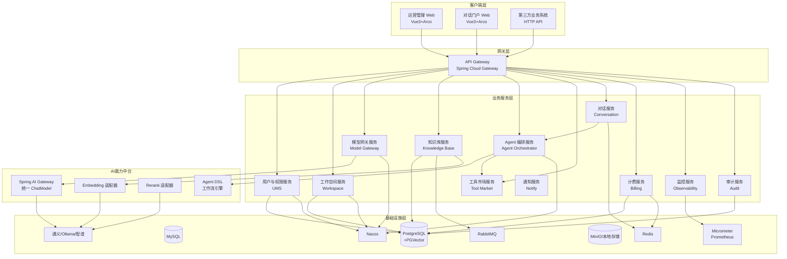
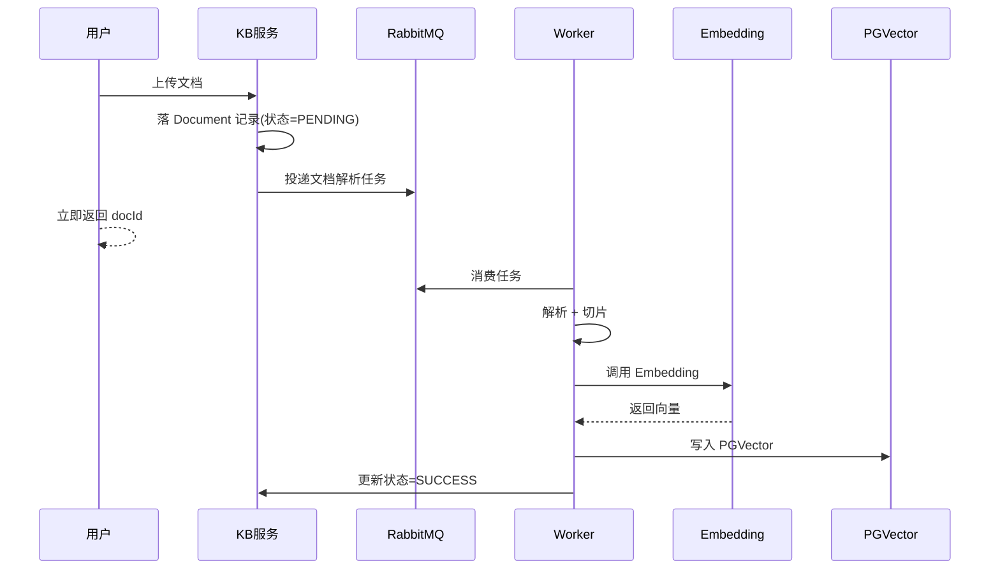
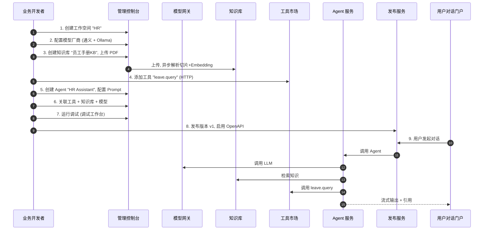
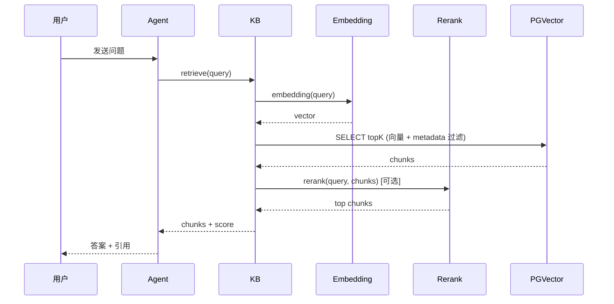
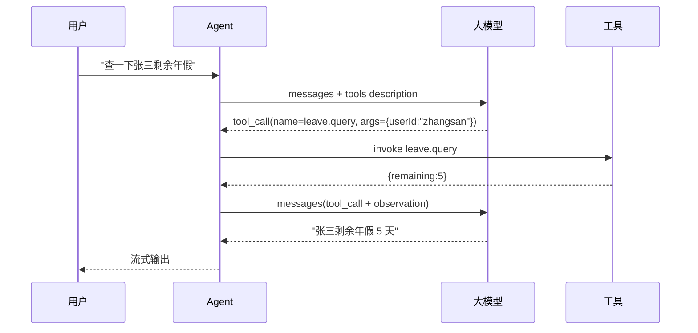
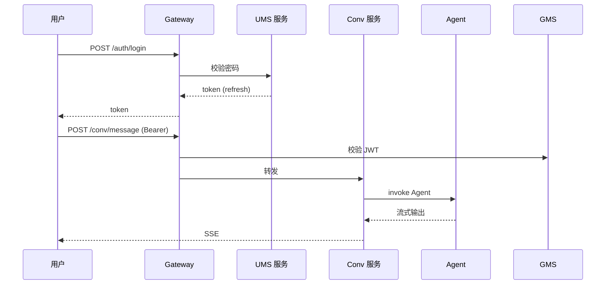
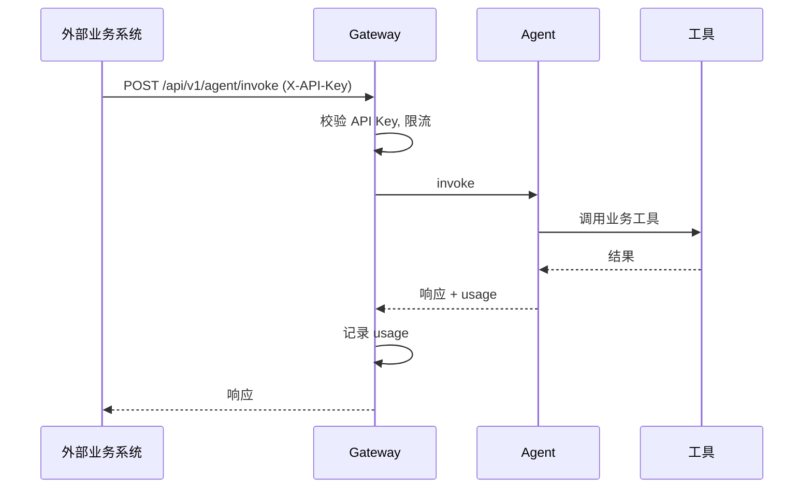
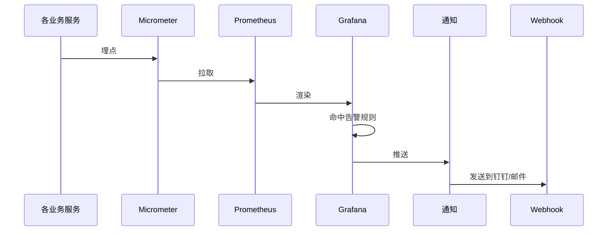

# 智擎 AI（InsightEngine）—— 企业级 AI Agent 编排与知识中枢平台

> 产品需求文档（PRD）
>
> 本文档面向项目的需求定义、产品设计、架构设计、开发交付、测试验收全流程，作为项目唯一的"产品真理来源（Single Source of Truth）"。
>
> 本项目的核心目标：通过一个**真实落地、企业真实在用、当前 AI 互联网主流方向**，且**非烂大街**的产品形态，全面覆盖简历中提及的 Java 后端核心技能栈（Spring Boot / Spring Cloud Alibaba / Spring AI / LangChain4j / RabbitMQ / MyBatis / PostgreSQL+PGVector / Redis / Docker / Vue3），并形成可上简历的项目经历。

---

## 目录

- 第 1 章 文档信息
- 第 2 章 项目背景与立项依据
- 第 3 章 市场分析、竞品分析与差异化
- 第 4 章 产品愿景、定位与成功指标
- 第 5 章 用户画像
- 第 6 章 需求范围（In/Out Scope）
- 第 7 章 名词与领域术语表
- 第 8 章 业务架构蓝图
- 第 9 章 技术架构蓝图
- 第 10 章 功能架构总览
- 第 11 章 信息架构（菜单树与门户视图）
- 第 12 章 核心模块详细设计
  - 12.1 账号、组织与工作空间
  - 12.2 权限中心（RBAC + ABAC）
  - 12.3 统一认证（SSO / OIDC / JWT）
  - 12.4 模型网关与多模型路由
  - 12.5 Prompt 设计与调试工作台
  - 12.6 知识库（RAG 引擎）
  - 12.7 Agent 编排（可视化工作流 + Function Calling）
  - 12.8 工具市场
  - 12.9 对话与运行门户
  - 12.10 OpenAPI / SDK / Webhook
  - 12.11 计费、配额与账单
  - 12.12 监控、审计与可观测性
  - 12.13 通知中心
  - 12.14 系统设置与平台管理
- 第 13 章 核心业务流程（端到端）
- 第 14 章 数据模型（核心表结构）
- 第 15 章 非功能性需求
- 第 16 章 安全与合规要求
- 第 17 章 部署架构与交付方式
- 第 18 章 版本规划与里程碑
- 第 19 章 风险评估与应对
- 第 20 章 整体验收标准
- 第 21 章 附录：参考与扩展阅读

---

## 第 1 章 文档信息

| 项目 | 内容 |
|------|------|
| 产品代号 | InsightEngine（智擎 AI） |
| 产品名称 | 智擎 AI · 企业级 Agent 编排与知识中枢 |
| 文档版本 | v1.0（基线版本，用于 MVP 开发） |
| 撰写日期 | 2026-08-25 |
| 撰写人 | 产品组 |
| 状态 | 评审稿 |
| 关联文档 | 《技术方案 TD》、《接口设计 IF》、《测试用例 TS》、《部署运维手册 OPS》 |
| 评审对象 | 后端架构师、前端负责人、测试负责人、运维负责人 |
| 范围目标 | 1 名全栈工程师可独立完成 MVP；8 周可交付 V1.0 试商用版 |

### 1.1 文档阅读指引

- 第 2~6 章 用于向**业务方/导师/面试官**讲清楚"为什么做这个"。
- 第 8~10 章 用于向**架构师/后端**讲清楚"怎么拆"。
- 第 12 章 用于向**前端**讲清楚"页面怎么画"。
- 第 13~14 章 用于向**开发/测试**讲清楚"流程怎么走、字段怎么建"。
- 第 15~17 章 用于向**运维/SRE** 讲清楚"怎么发布、怎么运维"。
- 第 18~20 章 用于向**项目管理**讲清楚"怎么交付、怎么验收"。

---

## 第 2 章 项目背景与立项依据

### 2.1 背景：从"会用 LLM"到"用好 LLM"的鸿沟

从 2023 年 ChatGPT 引爆大模型竞赛，到 2024 年通义、文心、智谱、DeepSeek 等国产大模型全面铺开，再到 2025~2026 年的 **Agentic AI 时代**，大模型已不再是"能不能用"的问题，而是"如何用在真实业务中"的问题。然而多数企业的现状是：

1. **直接调用大模型 API** 的方式，缺少工程化能力，包括上下文记忆管理、私域知识接入、工具调用、权限隔离、审计计费等。
2. **Copilot 形态**（如 Copilot for XXX）多被厂商绑定，企业无法在自己的数据域上构建可治理的 AI 能力。
3. **开源方案**（LangChain、LlamaIndex 等）解决了"能不能跑"，但**企业级的多租户、可观测、权限、配额**等工程能力缺失。

由此催生了一类新品类：**企业级 AI Agent 编排平台 / 企业 AI PaaS**。代表产品包括 Coze（字节）、Dify（开源）、FastGPT（开源）、BetterYeah（云厂商系）、阿里云百炼、腾讯元器、AWS Bedrock Agents、Azure AI Studio 等。这些产品**在中大型企业内部确实在采购、在使用**，业务覆盖客服、营销、研发、运营、法务、财务等多个场景。

### 2.2 项目立项动机

本次项目的根本目的，是通过一个**真实落地、可上线、可被面试官认可为"做过"**的产品形态，**完整地实战简历中列出的全部技术栈**。具体动机：

1. **能力复盘**：由于长时间离开编码一线，需要通过一个有清晰边界的产品把 Java 17/21、Spring Boot 3、Spring Cloud Alibaba、Spring AI、LangChain4j、RabbitMQ、MyBatis-Plus、PostgreSQL+PGVector、Redis、Nacos、OpenFeign、Docker、Vue 3 等技术全部串起来实战一遍。
2. **贴近产业**：选品必须**符合 2025~2026 年 AI 应用工程化的主航道**，且**不是人人都在做的题（如"AI 聊天机器人""图片生成器""翻译助手"这种 ToC 玩具）**，而是**真实企业付费采购的方向**。
3. **可增量扩展**：MVP 必须可在单机/单库情况下完整跑通；后续能够无破坏地扩展为生产级多节点部署，并支持 SaaS 与私有化两种交付方式。
4. **可写进简历**：项目所产出的功能、模块、复杂度，必须达到能写进简历项目经历的颗粒度（包含**架构图、关键指标、踩坑、扩展设计**）。

### 2.3 业务机会与价值主张

**一句话价值主张**：
> "让一家中大型企业，在 **一个工作日** 内，把私域知识、已有业务系统、自研大模型能力，组合成一个**可治理、可计量、可审计、可被业务方直接调用**的 AI Agent，并通过 API 或嵌入式组件交付给一线员工与外部用户。"

**价值主张拆解**：

| 价值点 | 含义 |
|--------|------|
| 一个工作日 | 通过可视化编排与模板市场，降低 AI 应用上线周期 |
| 私域知识 | 支持企业自有文档（PDF/Word/Markdown/表格/网页）接入 |
| 已有业务系统 | 通过工具市场（HTTP / 函数 / 数据库 / 文件）连接 |
| 自研大模型 | 多模型网关 + 统一协议，可灵活切换 |
| 可治理 | 多租户隔离 + RBAC + 审计日志 |
| 可计量 | Token 用量、调用次数、并发、延时多维度计量 |
| 可审计 | 全链路 Trace + 输入输出留痕 |
| 嵌入式交付 | API / SDK / Webhook / iframe 多形态 |

---

## 第 3 章 市场分析、竞品分析与差异化

### 3.1 目标市场（SAM/SOM）

- **TAM**：全球 AI Agent 与企业 AI 应用市场，2026 年预估 800+ 亿美元。
- **SAM（可服务市场）**：中文区 + 中国出海企业，年付费意愿 + 私有化部署意愿明确中大型企业，预估 100 亿规模。
- **SOM（可获取市场）**：本项目**不直接面向商业化**，而以"作品级项目"产出，但需保证**功能深度上达到真实商用产品的 70%**。

### 3.2 竞品对比（仅作差异化定位参考，不直接抄 UI/功能）

| 产品 | 形态 | 优势 | 劣势 | 对本项目启示 |
|------|------|------|------|-------------|
| Coze（扣子） | SaaS | 生态丰富、插件多 | 闭源、私有化难、计费颗粒粗 | 学其"工具市场"思路，但坚持私有化部署能力 |
| Dify | 开源 + 商业版 | 开源生态、YAML DSL、模型中立 | 工程化能力弱（无原生 RBAC、监控薄弱） | 把 Dify 的"可视化编排"做到工程化、可治理 |
| FastGPT | 开源 | 国产开源、知识库场景深 | 工作流能力弱、缺多模型路由 | 把知识库做成模块化、可插拔 |
| 阿里云百炼 | SaaS | 大模型生态强、与阿里云深度集成 | 绑定阿里云、定制能力受限 | 学其"模型路由 + 评测"思路 |
| 腾讯元器 | SaaS | 腾讯生态、内容安全 | 起步晚、生态弱 | 学其"内容安全 + 审核流" |
| BetterYeah | SaaS | 国内中端市场、模板化 | 缺开源、扩展能力弱 | 学其"模板化 + 场景库" |
| n8n / Flowise | 开源工作流 | 可视化、节点多 | 非 LLM 原生、缺 RAG 内核 | 不在本项目比较范围，作为扩展参考 |
| OpenAI Assistants / Anthropic Claude Tools | 商业 SaaS | 模型原生 | 锁定厂商、不可私有化 | 学其"Tool Calling 协议" |

### 3.3 差异化定位（差异化即"为啥选你"）

**差异化主张**：

> **"一个真正能在企业生产环境落地的 AI Agent 编排平台"——具备工程级 RBAC、可计量、可私有化、可观测、可被嵌入业务的端到端能力；不做'又一个 ChatGPT 套壳'。**

差异化按维度拆解：

| 维度 | 一般 ToC 套壳 | 开源竞品 | **本项目** |
|------|--------------|---------|-----------|
| 多租户隔离 | ✗ | △ | ✓（租户级 + 工作空间级 + 资源配额） |
| RBAC + ABAC | ✗ | △ | ✓（角色 + 资源 + 数据行级） |
| 私有化部署 | ✗ | △ | ✓（Docker Compose + K8s Helm，单机也可起） |
| 模型中立 | ✗ | ✓ | ✓（统一 ChatModel 抽象 + 适配器模式） |
| Agent 协议 | ✗ | ✓ | ✓（ReAct / Function Calling / Plan-and-Execute 三种内置） |
| RAG 深度 | 简单向量检索 | ✓ | ✓（切片策略、混合检索、重排、引用溯源） |
| 可观测 | ✗ | △ | ✓（TraceID 串联 + 调用链 + Token 计量） |
| OpenAPI | △ | △ | ✓（OpenAPI 3.1 + SDK 生成 + Webhook） |
| 计费与配额 | ✗ | △ | ✓（企业配额 + 个人配额 + 账单导出） |
| 代码可见性 | ✗（闭源） | ✓ | ✓（自研 + 关键代码可写博客） |

---

## 第 4 章 产品愿景、定位与成功指标

### 4.1 产品愿景

**短期（一期 MVP）**：完整可演示的本地化单租户版本，包含账号、模型、知识库、Agent、工具、对话门户、OpenAPI、计费、监控九大模块。

**中期（二期）**：引入多租户、Sentinel 限流、调用链追踪、模板市场。

**长期（三期）**：私有化 Helm Chart + 多模型推理路由 + Plugin Marketplace + Agent 评测体系。

### 4.2 产品定位

| 维度 | 定位 |
|------|------|
| 目标用户 | 中大型企业的 AI 创新部门、业务部门（客服、营销、运营、研发）、IT 部门 |
| 核心场景 | 私域知识问答、业务流程自动化、研发 Copilot、客服辅助 |
| 交付形态 | SaaS（演示）+ Docker Compose（本地化交付）+ Helm（生产） |
| 商业模式（演示用） | 按 Token + Agent 调用次数的配额计费 |

### 4.3 商业成功指标（用于"项目价值感"）

| 指标 | MVP 目标 | V1.0 目标 | V2.0 目标 |
|------|---------|---------|-----------|
| 支持接入模型数 | ≥ 3 | ≥ 6 | ≥ 10 |
| 单知识库最大文档量 | 1000 | 10,000 | 100,000 |
| 单 Agent 最大工具数 | 10 | 30 | 100 |
| 单租户最大工作空间数 | 1 | 10 | 不限 |
| API QPS | 10 | 100 | 1000 |
| 平均对话首字响应（Streaming） | < 2s | < 1.2s | < 1s |
| 文档解析吞吐 | 5 文档/分钟 | 50 文档/分钟 | 500 文档/分钟 |
| 可用性 | 95% | 99% | 99.9% |

### 4.4 学习/求职成功指标（项目最重要的"业务指标"）

| 指标 | 含义 | 验收 |
|------|------|------|
| 技能覆盖率 | 简历中提到的 8 大类技能是否都通过本项目落地 | 100%（每条都有对应模块） |
| 模块完成度 | PRD 中 P0 模块的实现比例 | ≥ 100% P0 |
| 文档完整度 | 技术文档 + 接口文档 + 部署文档 | 完整 |
| 可写进简历的内容 | 项目架构图、关键模块设计、踩坑记录、性能数据 | 各 ≥ 1 |
| 可演示性 | 5 分钟内可向面试官跑通"建工作空间→接入模型→建知识库→编排 Agent→发布 API" | 流畅 |

---

## 第 5 章 用户画像

本项目面向"企业用户"和"开发者用户"两类。开发者用户是企业内的技术角色，企业用户是企业内的业务角色。

### 5.1 核心用户：企业 AI 平台管理员（Tenant Admin）

- **身份**：中大型企业 IT/AI/数字化部门负责人
- **年龄**：28~45 岁
- **典型场景**：负责公司内部"AI 中台"的搭建，向上汇报，向下对接业务方
- **痛点**：
  - 多业务方诉求难以在一个平台统一管理
  - 大模型 API 零散接入，无统一计费与配额
  - 数据安全合规（金融、政府、医疗场景无法接受 SaaS）
- **期望**：拥有与企业 IM、SSO、审计、监控体系兼容的 AI 中台

### 5.2 核心用户：AI 应用开发者（App Builder）

- **身份**：业务部门/创新部门开发者
- **年龄**：24~35 岁
- **典型场景**：用低代码方式搭建业务 AI 应用（如"合同审查助手"）
- **痛点**：
  - 写 Prompt 反复调试，缺乏统一调试环境
  - 想接入业务系统 API，但每次都要写一遍适配代码
  - 想加知识库，但不知道文档怎么切片、怎么检索
- **期望**：可视化编排 + 一键发布 + 调用量与日志可视化

### 5.3 核心用户：业务使用者（End User）

- **身份**：业务一线员工（销售、客服、运营）
- **典型场景**：在 IM/浏览器中调用 AI 应用
- **痛点**：
  - 工具分散，需要切换多个系统
  - 无法跟踪自己的对话历史
- **期望**：统一的对话门户、对话历史、可"点赞/踩"反馈

### 5.4 次要用户：平台运营（Operator）

- **身份**：平台运营/计费运营
- **痛点**：额度不够预警、余额耗尽、单租户异常告警
- **期望**：可视化运营大盘 + 告警推送

### 5.5 次要用户：审计/合规

- **身份**：审计或合规岗位
- **痛点**：历史对话与调用回溯、敏感词告警
- **期望**：全量留痕 + 检索 + 导出

---

## 第 6 章 需求范围

### 6.1 In Scope（MVP / V1.0 / V2.0 全部"本产品"覆盖）

**MVP（第一阶段：8 周）**：

- 账号、组织、工作空间（单租户）
- 用户、角色、权限（RBAC）
- 模型网关（接入通义千问、Ollama，OpenAI 兼容协议）
- 知识库（文档上传、解析、切片、向量化、检索）
- Agent（Prompt + Function Calling + 单轮工具调用）
- 工具市场（HTTP 工具、函数工具，2 类共 6 个内置）
- 对话门户（Web 端流式输出）
- OpenAPI（对话接口 + 知识库查询接口）
- 基础监控（请求日志 + Token 用量）
- 部署：Docker Compose

**V1.0（在 MVP 基础上增量，4 周）**：

- 多租户
- 多模型路由 + 故障转移
- Agent 可视化工作流（自研 DSL）
- 异步任务（RabbitMQ）
- 限流（Sentinel / Resilience4j）
- 审计日志增强
- 计费账单导出（EasyExcel）
- Helm Chart 草版

**V2.0（再增量 4 周）**：

- 模型评测
- 模板市场
- Webhook + Embed iFrame
- 告警中心（钉钉/飞书/邮件）
- 数据导入与初始化
- 内容安全审核流

### 6.2 Out of Scope（明确不做，避免期望膨胀）

- 训练/微调大模型（仅接入已有模型）
- 移动端原生 App（仅响应式 Web）
- 接入企业内部 IM（提供 OpenAPI + Webhook，由集成方实现）
- 自建计费支付通道（仅生成账单，不收款）
- 跨租户的 Agent 共享市场（V2.0+ 视情况）
- 端到端的零代码（V1.0 仍需简单 JSON / DSL）

---

## 第 7 章 名词与领域术语表

| 术语 | 英文 | 含义 |
|------|------|------|
| 租户 | Tenant | 数据与资源的最大隔离单位，对应一个企业客户 |
| 工作空间 | Workspace | 租户内的二级隔离，可对应一个业务部门 / 项目 |
| 应用 | App | 一个可独立对外提供服务的 AI Agent，对应一个发布单元 |
| 对话 | Conversation | 用户在某个 App 下产生的一次会话，含多轮 Message |
| 消息 | Message | 一条用户消息/AI 回复/系统消息 |
| 知识库 | Knowledge Base | 文档库（KB），内部为 Collection 文档分片 |
| 文档分片 | Chunk | 文档被切分后的最小检索单元 |
| Embedding | Embedding | 把 Chunk 转为向量的过程与结果 |
| 检索 | Retrieval | 从向量库与倒排中检索 TopK |
| 重排 | Rerank | 用 Rerank 模型对 TopK 重排序 |
| 工具 | Tool | Agent 可调用的能力单元（HTTP、函数、数据库、文件） |
| Agent | Agent | 由 Prompt + 工具集 + 知识库构成的执行单元 |
| 工作流 | Workflow | 由多个节点（LLM、工具、条件、循环）组成的有向图 |
| 模型路由 | Model Routing | 根据策略路由到不同模型的机制 |
| 计费 | Billing | 基于 Token 与调用次数的用量计量 |
| OpenAPI | OpenAPI | 平台对外暴露的 API |
| Webhook | Webhook | 平台向外部推送事件的 HTTP 回调 |
| 配额 | Quota | 单租户/工作空间/用户在单位时间内的资源上限 |
| 调用链 | Trace | 一次请求在多个微服务间调用的链路 |
| RBAC | RBAC | 基于角色的访问控制 |
| ABAC | ABAC | 基于属性的访问控制（本项目用于资源级二次校验） |

---

## 第 8 章 业务架构蓝图

### 8.1 业务总览图

> 用 Mermaid 描绘（开发时可渲染成图）。



### 8.2 业务分层说明

| 层 | 关注点 |
|----|--------|
| 客户端层 | 运营管理端（账号、模型、知识库、Agent 配置）、对话端（用户使用） |
| 网关层 | 鉴权、限流、路由、灰度、灰度规则、跨域 |
| 业务服务层 | 11 个微服务，按"高内聚、低耦合"组织 |
| AI 能力中台 | 抽象大模型能力，对内提供 ChatModel/Embedding/Rerank 三类 SDK |
| 基础设施层 | 数据库、消息、缓存、注册中心、对象存储、可观测、大模型 |

---

## 第 9 章 技术架构蓝图

### 9.1 总体技术栈

| 类别 | 技术 | 用途 |
|------|------|------|
| 语言 | Java 17（MVP）/ Java 21（V1.0 升级） | 主语言 |
| 框架 | Spring Boot 3.x | 后端主体 |
| 微服务 | Spring Cloud Alibaba 2022/2023 | 服务治理 |
| 注册/配置 | Nacos 2.x | 注册中心 + 配置中心 |
| 网关 | Spring Cloud Gateway | API 网关 |
| 服务调用 | OpenFeign | 微服务间调用 |
| 限流 | Sentinel | 限流/熔断/降级 |
| ORM | MyBatis-Plus 3.5.x | 业务数据持久化 |
| 关系库 | PostgreSQL 15（含 PGVector 扩展） | 主业务库 + 向量库 |
| 关系库（备） | MySQL 8（开发期可替） | 不强依赖 |
| 缓存 | Redis 7 | 缓存、Session、配额、限流计数 |
| 消息 | RabbitMQ 3.x | 异步任务、事件驱动 |
| 对象存储 | MinIO | 文档、头像 |
| AI 框架 | Spring AI + LangChain4j | 大模型抽象 |
| 大模型 | 通义千问 / Ollama(Qwen2.5 / Llama3) / 智谱 | 推理能力 |
| Embedding | text-embedding-v3 / bge-m3 | 向量化 |
| Rerank | bge-reranker / qwen-rerank | 重排 |
| 前端 | Vue 3 + Vite + TypeScript + Arco Design | UI |
| 状态 | Pinia | 前端状态管理 |
| HTTP | Axios | 请求 |
| 路由 | Vue Router | 路由 |
| 可观测 | Micrometer + Prometheus + Grafana + Loki（可选） | 指标、日志 |
| 鉴权 | JWT（jjwt）+ Spring Security | 认证授权 |
| 文档 | Knife4j | API 文档 |
| 工具 | Hutool / Lombok | 编码提效 |
| Excel | EasyExcel | 导出账单 |
| 部署 | Docker + Docker Compose（V1.0+ 增加 K8s Helm） | 交付 |
| CI | GitHub Actions（演示环境可用） | 持续集成 |
| 测试 | JUnit5 / Mockito / Testcontainers | 后端测试 |

### 9.2 模块划分（微服务）

> MVP 阶段为节省资源，部分服务可合并部署，但代码层面按服务拆分。V1.0 起完全拆分。

| 服务 | 端口 | 端口（容器） | 职责 |
|------|------|-------------|------|
| gateway | 7000 | 7000 | 统一入口、鉴权、限流、路由 |
| ums | 7101 | 8081 | 用户、角色、权限 |
| workspace | 7102 | 8082 | 工作空间、组织 |
| model | 7103 | 8083 | 模型接入、路由、计量 |
| kb | 7104 | 8084 | 知识库、文档、切片、检索 |
| agent | 7105 | 8085 | Agent、工作流、工具调用 |
| tool | 7106 | 8086 | 工具市场（HTTP/函数/数据库） |
| conv | 7107 | 8087 | 对话、消息、流式输出 |
| billing | 7108 | 8088 | 配额、计量、账单 |
| obs | 7109 | 8089 | 监控、审计、Trace |
| notify | 7110 | 8090 | 通知中心（Webhook/邮件） |
| web-admin | 7200 | 80 | 管理控制台（前端） |
| web-chat | 7201 | 81 | 对话门户（前端） |

### 9.3 工程结构

```
insight-engine/
├── pom.xml                                  # 父 POM，dependencyManagement
├── README.md
├── docker-compose.yml
├── Dockerfile
├── insight-engine-dependencies/             # BOM
├── insight-engine-common/                   # 公共：异常、响应、工具类、常量
├── insight-engine-starter-web/              # Web 起步依赖（统一异常、TraceID、用户上下文）
├── insight-engine-starter-mybatis/           # MyBatis-Plus 起步依赖
├── insight-engine-starter-security/         # Security + JWT
├── insight-engine-starter-redis/            # Redis 起步依赖
├── insight-engine-starter-nacos/            # Nacos 起步依赖
├── insight-engine-starter-ai/               # Spring AI + LangChain4j 起步依赖
├── insight-engine-starter-observability/    # Micrometer
├── insight-engine-modules/
│   ├── insight-engine-gateway/
│   ├── insight-engine-ums/
│   ├── insight-engine-workspace/
│   ├── insight-engine-model/
│   ├── insight-engine-kb/
│   ├── insight-engine-agent/
│   ├── insight-engine-tool/
│   ├── insight-engine-conv/
│   ├── insight-engine-billing/
│   ├── insight-engine-obs/
│   └── insight-engine-notify/
├── insight-engine-web/
│   ├── insight-engine-admin/                # Vue3 + Arco
│   └── insight-engine-chat/                 # Vue3 + Arco
└── docs/
    ├── PRD.md                               # 本文档
    ├── TD.md                                # 技术方案
    ├── IF.md                                # 接口设计
    └── OPS.md                               # 部署运维
```

### 9.4 公共依赖设计

#### 9.4.1 统一响应体

```json
{
  "code": 0,
  "message": "ok",
  "data": { ... },
  "traceId": "ab12...",
  "ts": 1724567890123
}
```

#### 9.4.2 错误码规范

| 错误码段 | 含义 |
|---------|------|
| 0 | 成功 |
| 1xxx | 通用错误（参数、限流、权限） |
| 2xxx | 用户与权限 |
| 3xxx | 模型网关 |
| 4xxx | 知识库 |
| 5xxx | Agent |
| 6xxx | 工具 |
| 7xxx | 对话 |
| 8xxx | 计费 |
| 9xxx | 系统 |

错误规范：`{bizCode}:{subCode}`，如 `2001` 表示"用户未登录"。

#### 9.4.3 TraceID 传递

- HTTP: 通过 `X-Trace-Id` 头透传
- 微服务间：Feign Interceptor 自动注入
- 日志：logback 模式中输出 traceId
- 前端：Axios 拦截器注入与捕获

#### 9.4.4 统一异常

- 自定义 `BizException`（含 errorCode、errorMsg）
- `GlobalExceptionHandler` 统一包装成 `Result`
- 网关层统一返回

#### 9.4.5 用户上下文

- 基于 SLF4J MDC + 自定义 `UserContextHolder`（ThreadLocal）
- JWT 解析后写入

---

## 第 10 章 功能架构总览

按"业务域"组织，每一业务域描述子模块。

### 10.1 业务域与子模块

| 业务域 | 子模块 | MVP | V1.0 | V2.0 |
|--------|--------|-----|------|------|
| 账号与组织 | 登录/注册、SSO、用户、组织、工作空间 | ✓ | ✓ | ✓ |
| 权限中心 | 角色、资源、菜单、数据权限 | ✓ | ✓ | ✓ |
| 模型网关 | 厂商接入、模型路由、限流、Token 用量 | ✓ | ✓ | ✓ |
| 知识库 | 文档管理、解析、切片、检索、重排 | ✓ | ✓ | ✓ |
| Agent | Prompt 调试、Agent 配置、工具调用、可视化工作流 | ✓ | ✓ | ✓ |
| 工具市场 | 内置工具、自定义 HTTP、函数、数据库、文件 | ✓ | ✓ | ✓ |
| 对话 | 会话、消息、流式、历史、点赞点踩 | ✓ | ✓ | ✓ |
| 发布 | App 发布、API、SDK、Webhook、Embed | ✓ | ✓ | ✓ |
| 计费 | 配额、计量、账单导出 | ✓ | ✓ | ✓ |
| 监控 | 用量监控、调用链、Trace、告警 | △（基础） | ✓ | ✓ |
| 审计 | 操作日志、对话留痕、检索、导出 | △（基础） | ✓ | ✓ |
| 通知 | 站内信、邮件、Webhook | ✗ | ✓ | ✓ |
| 系统 | 字典、参数、公告 | △ | ✓ | ✓ |

### 10.2 模块依赖

```
账号与组织 ──┐
权限中心 ────┼──> 所有业务域
工作空间 ────┘

模型网关 <── Agent
       <── 对话

知识库 <── Agent
       <── 对话

工具 <── Agent

对话 <── 外部 API / SDK / 嵌入

监控 <── 所有服务
审计 <── 所有服务
计费 <── 模型网关、Agent、对话、工具
通知 <── 计费、监控、审计
```

---

## 第 11 章 信息架构（菜单树与门户视图）

> 给前端/UX 的页面骨架；功能域在前端拆分为三个入口：管理控制台、对话门户、开发者门户。

### 11.1 管理控制台（Admin Web）菜单

```
控制台首页
│
├── 组织与人员
│   ├── 工作空间
│   ├── 成员
│   ├── 角色与权限
│   └── 审计日志
│
├── 模型管理
│   ├── 模型厂商
│   ├── 模型列表
│   ├── 模型路由
│   └── 用量监控
│
├── 知识库
│   ├── 知识库列表
│   ├── 文档管理
│   └── 检索测试
│
├── Agent 与应用
│   ├── 应用列表
│   ├── Agent 编辑器
│   ├── 工作流编排
│   └── 发布管理
│
├── 工具市场
│   ├── 内置工具
│   ├── 自定义工具
│   └── 我的收藏
│
├── 计费与配额
│   ├── 套餐与配额
│   ├── 用量账单
│   └── 充值记录（MVP 占位）
│
├── 监控
│   ├── 系统指标
│   ├── 调用链
│   └── 告警中心
│
├── API 与集成
│   ├── OpenAPI
│   ├── API Key
│   ├── Webhook
│   └── SDK 下载
│
└── 系统设置
    ├── 公告
    ├── 字典
    └── 关于
```

### 11.2 对话门户（Chat Web）信息架构

```
对话门户
├── 应用市场（按可见性过滤后）
│   ├── 推荐
│   ├── 收藏
│   └── 历史
├── 对话详情
│   ├── 消息流
│   ├── 输入区
│   ├── 工具引用/知识引用面板
│   └── 反馈
└── 个人中心
    ├── 个人设置
    ├── 我的反馈
    └── API Key
```

### 11.3 开发者门户（Dev Portal）信息架构

```
开发者门户
├── 入门
├── 接口文档
├── API Key 管理
├── 调用统计
├── Webhook
└── SDK 下载
```

---

## 第 12 章 核心模块详细设计

> 每个模块包含：功能概述、用户故事、前置条件、业务规则、字段定义、交互流程、异常流程、验收标准（AC）、非功能性需求。模块非常多，下面精选 P0 模块详写；P1/P2 模块做精简描述。

---

### 12.1 账号、组织与工作空间

#### 12.1.1 模块定位

平台的"账号、组织、工作空间"是所有业务实体的"容器"。本模块设计重点：

- **单租户（MVP）/ 多租户（V1.0）** 兼顾
- **组织（Organization）→ 工作空间（Workspace）→ 应用（App）** 三级结构
- 后续可平滑扩展为 "Tenant > Organization > Workspace > App"

#### 12.1.2 核心实体 ER（精简）

```
Organization (id, name, code, status, owner_id, created_at)
   └── Workspace (id, org_id, name, code, status, plan_id, created_at)
           └── App (id, workspace_id, name, code, type, status, created_at)
           └── Member (id, org_id, workspace_id, user_id, role_id, joined_at)
User (id, tenant_id, email, phone, password_hash, status, avatar, created_at)
```

#### 12.1.3 字段定义

**Organization**

| 字段 | 类型 | 必填 | 说明 |
|------|------|------|------|
| id | bigint | ✓ | 主键 |
| name | varchar(128) | ✓ | 组织名称 |
| code | varchar(64) | ✓ | 唯一编码（短链） |
| owner_id | bigint | ✓ | 所有者 user_id |
| status | tinyint | ✓ | 1:正常 0:禁用 |
| plan_id | bigint | ✓ | 套餐 id |
| created_at | datetime | ✓ | |
| updated_at | datetime | ✓ | |

**Workspace**

| 字段 | 类型 | 必填 | 说明 |
|------|------|------|------|
| id | bigint | ✓ | 主键 |
| org_id | bigint | ✓ | 所属组织 |
| name | varchar(128) | ✓ | 名称 |
| code | varchar(64) | ✓ | 唯一编码 |
| plan_id | bigint | ✓ | 工作空间级套餐 |
| max_apps | int | ✓ | 最大应用数 |
| max_kb_size_mb | int | ✓ | 知识库容量上限 |
| created_at | datetime | ✓ | |

**Member（成员关系）**

| 字段 | 类型 | 必填 | 说明 |
|------|------|------|------|
| id | bigint | ✓ | 主键 |
| org_id | bigint | ✓ | |
| workspace_id | bigint | ✗ | 可空：org 级管理员不挂在 workspace 下 |
| user_id | bigint | ✓ | |
| role_id | bigint | ✓ | 关联角色 |
| joined_at | datetime | ✓ | |

#### 12.1.4 功能列表

| 功能 | 优先级 | 说明 |
|------|--------|------|
| 注册 | P0（MVP 但可只留 admin） | 邮箱/手机号注册 |
| 登录 | P0 | 账号密码 + JWT |
| 退出 | P0 | |
| 个人信息 | P0 | |
| 修改密码 | P0 | |
| 头像上传 | P1 | |
| 组织创建 | P0（admin 触达） | |
| 工作空间创建 | P0 | |
| 工作空间切换 | P0 | |
| 成员邀请 | P0 | |
| 成员移除 | P0 | |
| 工作空间转让 | P1 | |
| SSO（OIDC） | P2 | V2.0 |

#### 12.1.5 关键交互：登录

**用户故事**：作为一名已注册用户，我希望通过账号密码登录系统，以使用平台功能。

**前置条件**：用户已注册且未禁用。

**业务规则**：
- 密码错误 5 次锁定账号 30 分钟
- JWT 过期 2 小时，刷新 token 7 天
- 登录态在 Redis 存储，可主动失效
- 强制 HTTPS（演示环境可配 http））

**接口**：
- `POST /auth/login`：账号密码
- `POST /auth/refresh`：刷新
- `POST /auth/logout`：登出

**请求示例**：
```json
POST /auth/login
{
  "email": "user@example.com",
  "password": "xxxx"
}
```

**返回示例**：
```json
{
  "code": 0,
  "data": {
    "token": "eyJ...",
    "refreshToken": "eyJ...",
    "userId": 10001,
    "orgId": 1,
    "workspaceId": 1,
    "roles": ["admin"]
  }
}
```

**异常流程**：

| 异常 | 响应 |
|------|------|
| 账号不存在 | code=2001 |
| 密码错误 | code=2002，递增失败次数 |
| 账号已锁定 | code=2003 |
| 账号已禁用 | code=2004 |
| 验证码错误（开启时） | code=2005 |

**AC**：
- [ ] 正确账号密码返回 token，错误返回标准错误码
- [ ] 连续 5 次失败后账号锁定 30 分钟
- [ ] 退出后 token 在 Redis 中失效
- [ ] 刷新 token 接口使用 refresh_token 兑换新 token
- [ ] 接口在 Knife4j 中可被查阅

#### 12.1.6 关键交互：创建工作空间

**用户故事**：作为组织管理员，我希望能创建新的工作空间，并将成员加入。

**业务流程**：
1. 用户点击"新建工作空间"
2. 填写名称、编码、套餐
3. 提交后系统创建 Workspace 记录并设置 Owner 角色
4. 用户可在工作空间内继续添加成员

**AC**：
- [ ] 编码必须全局唯一
- [ ] 创建者自动成为该工作空间的 Owner
- [ ] 名称长度 2~64 字符
- [ ] 套餐字段默认取组织套餐

---

### 12.2 权限中心（RBAC + ABAC）

#### 12.2.1 模块定位

权限是企业级产品的根本属性。本模块同时实现 **RBAC（基于角色）** 和 **ABAC（基于资源属性）** 两层控制。

#### 12.2.2 模型设计

```
User ── Role ── Permission ── Resource(资源类型) ── Action(动作)
                                                │
                                                └─ Scope(资源范围: ALL/ORG/WS/SELF)
```

**Permission 表**

| 字段 | 类型 | 必填 | 说明 |
|------|------|------|------|
| id | bigint | ✓ | 主键 |
| code | varchar(64) | ✓ | 权限编码，如 kb:read |
| name | varchar(128) | ✓ | 权限名 |
| resource | varchar(32) | ✓ | 资源类型 |
| action | varchar(32) | ✓ | 动作 |
| scope | varchar(16) | ✓ | ALL/ORG/WS/SELF |
| description | text | ✗ | |

**预置角色（MVP）**

| code | name | 内置权限 |
|------|------|----------|
| super_admin | 超级管理员 | 全部 ALL |
| org_admin | 组织管理员 | 组织下一切 |
| ws_admin | 工作空间管理员 | 工作空间内一切 |
| app_developer | 应用开发者 | kb:* agent:* tool:* |
| end_user | 业务用户 | app:use 仅限 SELF |

#### 12.2.3 关键交互：权限校验

**校验链**：
1. 网关层校验 JWT 合法性
2. 网关层校验 path 白名单 + RateLimit
3. 业务层 `@PreAuthorize("hasAuthority('kb:read')")` 校验功能权限
4. 业务层通过 `PermissionService.check(resource, action, scope, userId, obj)` 校验资源所有权
5. 数据行级过滤器（MyBatis 拦截器自动注入 `workspace_id` 条件）

#### 12.2.4 内置权限列表（MVP）

```
auth:*              认证管理
org:*               组织管理
ws:*                工作空间管理
member:*            成员管理
role:*              角色管理

model:vendor:*      模型厂商
model:list:*        模型列表
model:route:*       模型路由
model:usage:*       用量监控

kb:list:*           知识库
kb:doc:*            文档
kb:retrieval:*      检索

agent:list:*        Agent
agent:workflow:*    工作流
agent:publish:*     发布

tool:list:*         工具市场
tool:http:*         自定义 HTTP
tool:function:*     自定义函数
tool:builtin:*      内置工具

conv:list:*         对话
conv:message:*      消息

billing:quota:*     配额
billing:export:*    账单导出

obs:metric:*        指标
obs:trace:*         调用链
obs:alert:*         告警

audit:log:*         审计
audit:export:*      导出

api:*               OpenAPI
sdk:*               SDK
webhook:*           Webhook

system:*            系统设置
```

#### 12.2.5 AC

- [ ] 权限按"资源:动作"格式编码
- [ ] 角色与权限多对多
- [ ] 用户在不同工作空间可有不同角色
- [ ] 数据行级隔离通过 interceptor 自动注入
- [ ] 超管、组织管理员、工作空间管理员权限互不污染

---

### 12.3 统一认证（SSO / OIDC / JWT）

#### 12.3.1 模块定位

设计目标：

- MVP：账号密码 + JWT（jjwt）+ Redis 黑名单
- V1.0：Refresh Token 滑动续期
- V2.0：OIDC（兼容 Keycloak / Authing / 阿里云 IDaaS）

#### 12.3.2 JWT 设计

- **算法**：HS256（MVP）/ RS256（V1.0）
- **载荷**：
  - `sub`：userId
  - `org_id`：组织 id
  - `ws_id`：当前工作空间 id
  - `roles`：角色编码列表
  - `iat / exp`
- **签发方**：UMS 服务
- **校验方**：网关 + 业务服务

#### 12.3.3 安全要点

- 使用 `kid` 字段支持多套密钥轮换
- Refresh Token 仅用于获取新 Access Token
- Access Token 过期 2h，Refresh Token 过期 7d
- 黑名单（Redis）：登出后加入黑名单
- 终端绑定（V2.0）：限制 token 仅在登录设备使用

#### 12.3.4 AC

- [ ] JWT 签发与解析单测覆盖
- [ ] 网关层 token 校验顺序：黑名单 → 签名 → exp → 业务
- [ ] Refresh Token 单次使用即失效（MVP 可接受重复，V1.0 强化）
- [ ] Knife4j 集成 Bearer 鉴权

---

### 12.4 模型网关与多模型路由

#### 12.4.1 模块定位

模型网关是整个 AI 平台的核心基础设施之一。它向上对业务屏蔽大模型差异，向下兼容多厂商。

#### 12.4.2 设计目标

- 统一抽象：`ChatModel` / `EmbeddingModel` / `RerankModel`（Spring AI & LangChain4j 双适配）
- 模型厂商可插拔：通义、Ollama、智谱、OpenAI 兼容协议（DeepSeek、月之暗面等）
- 模型路由：按策略路由到不同模型
- 模型计量：每次调用上报 Token 与延时
- 模型限流：租户级 + 模型级 + 用户级三层

#### 12.4.3 核心实体

```
ModelVendor（厂商）── Model（模型）── ModelVersion（版本）
                                   └── Pricing（计价）
                                   └── RoutePolicy（路由策略）
                                   └── Quota（配额）
```

#### 12.4.4 字段定义

**ModelVendor**

| 字段 | 类型 | 必填 | 说明 |
|------|------|------|------|
| id | bigint | ✓ | |
| code | varchar(64) | ✓ | qwen / openai / ollama / zhipu |
| name | varchar(128) | ✓ | |
| base_url | varchar(255) | ✓ | API base |
| api_key_secret_id | bigint | ✓ | 密钥 id（密钥不入库明文） |
| type | varchar(16) | ✓ | CHAT / EMBEDDING / RERANK |
| enabled | tinyint | ✓ | |

**Model**

| 字段 | 类型 | 必填 | 说明 |
|------|------|------|------|
| id | bigint | ✓ | |
| vendor_id | bigint | ✓ | |
| code | varchar(128) | ✓ | qwen-plus / text-embedding-v3 |
| display_name | varchar(128) | ✓ | |
| type | varchar(16) | ✓ | CHAT/EMBEDDING/RERANK |
| context_window | int | ✓ | 上下文窗口 |
| input_price_per_1k | decimal(18,6) | ✓ | 输入 1k token 单价 |
| output_price_per_1k | decimal(18,6) | ✓ | 输出 1k token 单价 |
| status | tinyint | ✓ | 启用/禁用 |

**RoutePolicy（路由策略）**

| 字段 | 类型 | 必填 | 说明 |
|------|------|------|------|
| id | bigint | ✓ | |
| name | varchar(128) | ✓ | |
| rules | jsonb | ✓ | JSON DSL，DSL 见 §9.4.5 |
| priority | int | ✓ | |
| enabled | tinyint | ✓ | |

#### 12.4.5 路由 DSL（JSON 示例）

```json
{
  "strategy": "WEIGHTED",
  "fallback": true,
  "rules": [
    { "match": { "tenantTier": "PRO" }, "targets": [{"modelId": 1, "weight": 70}, {"modelId": 2, "weight": 30}] },
    { "match": { "tenantTier": "BASIC" }, "targets": [{"modelId": 3, "weight": 100}] }
  ]
}
```

支持策略：

- `WEIGHTED`：加权轮询
- `PRIORITY`：优先级
- `COST_OPTIMIZED`：优先便宜
- `LATENCY_OPTIMIZED`：优先延时
- `AB_TEST`：A/B 测试（百分比分流）

#### 12.4.6 关键交互：聊天补全

**用户故事**：作为业务调用方，我希望通过统一接口调用任意大模型，不关心底层厂商。

**接口**：

```
POST /api/v1/model/chat/completions
```

**请求**：

```json
{
  "model": "auto",
  "messages": [
    {"role": "system", "content": "You are an assistant."},
    {"role": "user", "content": "Hello"}
  ],
  "stream": true,
  "temperature": 0.7,
  "maxTokens": 1024,
  "extra": {
    "traceId": "abc"
  }
}
```

**响应（非流式）**：

```json
{
  "code": 0,
  "data": {
    "id": "cmpl-xxx",
    "model": "qwen-plus",
    "choices": [
      {
        "index": 0,
        "message": {"role": "assistant", "content": "Hi!"},
        "finishReason": "stop"
      }
    ],
    "usage": {
      "promptTokens": 12,
      "completionTokens": 3,
      "totalTokens": 15
    }
  }
}
```

**流式**：SSE（Server-Sent Events）。

#### 12.4.7 关键交互：Embedding

**接口**：

```
POST /api/v1/model/embeddings
{
  "model": "text-embedding-v3",
  "input": ["hello", "world"]
}
```

**响应**：

```json
{
  "code": 0,
  "data": {
    "model": "text-embedding-v3",
    "data": [
      {"index": 0, "embedding": [0.012, -0.003, ...], "tokens": 1}
    ],
    "usage": {"totalTokens": 2}
  }
}
```

#### 12.4.8 多厂商适配

通过 `ModelVendorAdapter` 抽象，每个厂商实现一次：

```
TongyiAdapter implements ChatAdapter
OllamaAdapter implements ChatAdapter
ZhipuAdapter implements ChatAdapter
OpenAICompatAdapter implements ChatAdapter  // 用于 DeepSeek/Moonshot 等兼容 OpenAI 协议的厂商
```

#### 12.4.9 限流 & 计量

- 限流：Sentinel，针对 `tenant + model + user` 三元组
- 计量：每次调用记录：

```
ModelUsageRecord(
  id, tenantId, workspaceId, userId, modelId,
  promptTokens, completionTokens, totalTokens,
  cost, latencyMs, status, errorCode, traceId, createdAt
)
```

通过 RabbitMQ 异步落库，Kafka/ClickHouse 备用（V2.0）。

#### 12.4.10 异常流程

| 异常 | 响应 | 处理 |
|------|------|------|
| 厂商超时 | 504 | 触发 fallback（若启用） |
| 厂商 429 | 429 | 计量临时性失败，重试+退避 |
| 模型不存在 | 4005 | 立即返回错误 |
| 余额不足 | 8001 | 立即返回错误 |
| 密钥错误 | 3001 | 立即返回错误，并告警 |

#### 12.4.11 AC

- [ ] 模型厂商可热插拔（动态加载）
- [ ] 支持至少 3 个厂商（MVP）
- [ ] 自动按模型路由策略分发
- [ ] 每次调用记录 Token 用量、费用、延时
- [ ] 流式与同步两种调用方式
- [ ] 流式 SSE 输出 chunk 含 traceId
- [ ] 单元测试覆盖至少 80% 分支
- [ ] Knife4j 接口演示可跑

---

### 12.5 Prompt 设计与调试工作台

#### 12.5.1 模块定位

让"Prompt 工程师"角色拥有一个独立工作台：变量、模板、历史、对比、Few-shot、版本。

#### 12.5.2 功能列表

| 功能 | 优先级 | 说明 |
|------|--------|------|
| Prompt 模板编辑 | P0 | 文本编辑器，支持 Markdown |
| 变量插值 | P0 | `{{var}}` 语法 |
| 提示词对比 | P1 | 多版本 A/B 对比输出 |
| Few-shot 示例集 | P0 | 多个示例合并到 Prompt |
| 调用测试 | P0 | 选模型 → 实时预览输出 |
| 用量统计 | P1 | 每次调试的 Token 用量 |
| 历史记录 | P0 | 调试历史 |
| 版本回滚 | P1 | Prompt 版本化 |
| 导入/导出 | P2 | JSON / YAML |

#### 12.5.3 实体设计

```
PromptTemplate (id, workspaceId, name, content, variables(json), version, status, createdBy, createdAt)
PromptExample (id, templateId, role, content, order)
PromptDebugRecord (id, templateId, userId, request(json), response(json), tokens, cost, latency, createdAt)
PromptVersion (id, templateId, version, content, snapshot(json), createdBy, createdAt)
```

#### 12.5.4 关键交互：调试

```
用户选择 Template → 选择模型 → 输入变量 → 点击"运行" → 实时流式输出
```

**接口**：
- `POST /api/v1/prompt/{id}/debug`
  - 入参：变量、模型、超参
  - 出参：流式输出 + 调试记录 id

**AC**：
- [ ] 变量缺失时给出提示
- [ ] 调试记录持久化
- [ ] 流式输出断线重连（V1.0）
- [ ] 单次调试消耗 Token 与成本实时展示

---

### 12.6 知识库（RAG 引擎）

#### 12.6.1 模块定位

知识库是"私域知识接入"的核心。本模块提供文档上传、解析、切片、向量化、检索、重排、引用溯源的全链路能力。

#### 12.6.2 设计目标

- 文档格式：PDF、Word、TXT、Markdown、CSV、HTML（MVP）；PPT/图片 OCR（V1.0）
- 切片策略：定长、句子、Markdown 标题、滑动窗口、自定义（V1.0）
- Embedding：可配置厂商与模型
- 检索：向量召回 + 关键词倒排（BM25）混合召回
- 重排：可选 Rerank 模型
- 引用溯源：返回每条 Chunk 的来源文档 ID、分片位置
- 文件存储：MinIO / 本地

#### 12.6.3 实体设计

```
KnowledgeBase(id, workspaceId, name, embeddingModelId, chunkSize, chunkOverlap, status, createdBy, createdAt)
   └── Document(id, kbId, name, sourceType, sourceUrl, status, totalChunks, totalTokens, totalChars, errorMsg, createdAt)
         └── Chunk(id, docId, kbId, idx, content, charCount, tokenCount, metadata(json), vector(vector))
         └── DocumentParseTask(id, docId, status, ...)
```

#### 12.6.4 文档解析流程



#### 12.6.5 切片策略

| 策略 | 描述 | MVP | V1.0 |
|------|------|-----|------|
| FIXED | 定长 + 重叠 | ✓ | ✓ |
| SENTENCE | 按句号分割 | ✓ | ✓ |
| MARKDOWN_HEADER | 按 H1/H2 | ✓ | ✓ |
| SEMANTIC | 语义切分 | ✗ | ✓ |
| CUSTOM | 自定义（基于模板） | ✗ | ✓ |

默认：`MARKDOWN_HEADER + SENTENCE`，最大 1000 字符，重叠 200。

#### 12.6.6 检索流程

```
query → 改写(可选) → Embedding → 向量召回 TopK*4 → BM25 召回 TopK*4 → 融合 → Rerank → TopK
```

融合方式：`Reciprocal Rank Fusion (RRF)`。

#### 12.6.7 关键交互：知识检索

**接口**：

```
POST /api/v1/kb/{kbId}/retrieve
```

**请求**：

```json
{
  "query": "年假是怎么规定的？",
  "topK": 5,
  "scoreThreshold": 0.5,
  "metadataFilter": {"dept": "HR"}
}
```

**响应**：

```json
{
  "code": 0,
  "data": {
    "chunks": [
      {
        "chunkId": 10001,
        "docId": 200,
        "docName": "员工手册.pdf",
        "content": "年假天数根据司龄计算...",
        "score": 0.87,
        "metadata": {"page": 12}
      }
    ],
    "usage": {"embeddingTokens": 5, "rerankTokens": 1024}
  }
}
```

#### 12.6.8 检索测试与对比

- 支持 "同时多个 embedding 模型对比"
- 支持 "检索策略对比"（向量 / 关键词 / 混合 / 重排）

#### 12.6.9 引用溯源

- Agent 输出每条事实时附带 `[{chunkId, docName, page}]`
- 前端展示为可点击来源

#### 12.6.10 异常流程

| 异常 | 响应 |
|------|------|
| 文档格式不支持 | 4001 |
| 文档过大 | 4002（> 50MB） |
| Embedding 失败 | 4003 |
| 检索超时 | 4004 |
| 知识库不存在 | 4005 |
| 知识库禁用 | 4006 |

#### 12.6.11 AC

- [ ] 文档上传立即返回 docId，异步处理
- [ ] 解析失败有完整 errorMsg
- [ ] 检索命中包含溯源
- [ ] 支持 metadataFilter
- [ ] PGVector 索引正确建立（IVFFlat 或 HNSW）
- [ ] 异步任务在 RabbitMQ 有重试与死信

---

### 12.7 Agent 编排

#### 12.7.1 模块定位

Agent 是业务价值的"容器"。本模块支持：

- **基础 Agent（MVP）**：Prompt + 工具 + 知识库 + 单轮调用
- **ReAct Agent（MVP）**：推理-行动-观察循环
- **可视化工作流（V1.0）**：节点式编排
- **Plan-and-Execute（V1.0）**：先计划再执行

#### 12.7.2 设计目标

- 把"Prompt / Tools / Knowledge"组合成一个可执行体
- 暴露"对话补全（chat）"与"工具调用（invoke）"两种调用形态
- 支持流式与非流式
- 支持 Token 计量、错误重试、超时、取消

#### 12.7.3 实体设计

```
Agent(id, workspaceId, appId?, name, description, systemPrompt, modelId,
      strategy(REACT/PLAN/FUNCTION_CALL), version, status, createdBy, createdAt)
AgentTool(agentId, toolId, enabled)
AgentKnowledgeBase(agentId, kbId, enabled)
AgentVersion(id, agentId, version, snapshot(json), createdBy, createdAt)
AgentInvocation(id, agentId, userId, request(json), response(json), toolCalls(json), tokens, cost, latency, traceId, createdAt)
```

#### 12.7.4 ReAct Agent 循环算法

```
while iter < maxIter:
  think = llm(prompt=currentContext)
  if think.toolCall:
    res = toolInvoke(think.toolCall)
    addObservation(res)
  else:
    return think.content
```

**最大迭代** 默认 5，可配置；超时 60s。

#### 12.7.5 Function Calling 协议

- 工具描述以 OpenAI Function Calling 协议为主
- LangChain4j + Spring AI 双适配
- 自定义工具通过 JSON Schema 描述参数

#### 12.7.6 关键交互：Agent 调用

**接口**：

```
POST /api/v1/agent/{id}/invoke
{
  "input": "帮我查一下张三的年假余额",
  "stream": true,
  "context": {"userId": "zhangsan"}
}
```

**流式响应**：SSE，event 类型有 `message / tool_call / tool_result / error / finish`。

**非流式**：

```json
{
  "code": 0,
  "data": {
    "id": "inv-xxx",
    "output": "张三剩余年假 5 天。",
    "toolCalls": [
      {"name": "leave.query", "args": {"userId": "zhangsan"}, "result": { ... }}
    ],
    "references": [
      {"chunkId": 10001, "docName": "员工手册.pdf", "page": 8, "content": "年假余额..."}
    ],
    "usage": {"promptTokens": 120, "completionTokens": 24, "totalTokens": 144},
    "latencyMs": 1320
  }
}
```

#### 12.7.7 可视化工作流（V1.0）

**节点类型**：

- 开始 / 结束
- LLM 节点
- 工具节点
- 知识库节点
- 条件节点
- 循环节点
- HTTP 节点
- 赋值节点（设置变量）
- 代码节点（运行沙箱化 JS / Python）
- 注释节点

**DSL（JSON）**：

```json
{
  "id": "wf-001",
  "name": "HR Assistant",
  "version": 1,
  "nodes": [
    {"id": "n1", "type": "llm", "ref": "model/1", "prompt": "..."},
    {"id": "n2", "type": "tool", "ref": "tool/8", "args": {"employeeId": "{{n1.userId}}"}},
    {"id": "n3", "type": "kb", "ref": "kb/2", "query": "{{n1.question}}"},
    {"id": "n4", "type": "end"}
  ],
  "edges": [
    {"from": "n1", "to": "n2", "branch": "tool"},
    {"from": "n1", "to": "n3", "branch": "kb"},
    {"from": "n2", "to": "n4"},
    {"from": "n3", "to": "n4"}
  ]
}
```

**引擎**：自研（基于状态机的执行器），不引入 Flowable 等外部 BPM 引擎（避免重型）。

#### 12.7.8 错误与重试

- 工具失败 → 重试最多 3 次 → 失败回退到提示模板
- LLM 失败 → 切换 fallback 模型
- 全局超时：默认 60s，可配置

#### 12.7.9 AC

- [ ] Agent 能调用工具并把工具结果回填到上下文
- [ ] ReAct 循环可中断、可恢复（V1.0）
- [ ] 每次调用生成 invocation 记录（Token、cost、trace）
- [ ] 可视化工作流执行状态可视化（V1.0）
- [ ] 工作流支持 Mock 模式（开发期调用模拟工具）

---

### 12.8 工具市场

#### 12.8.1 模块定位

把"工具"作为一等公民管理。内置工具覆盖企业常见场景，自定义工具支持业务扩展。

#### 12.8.2 工具分类

| 分类 | 典型工具 |
|------|----------|
| 内置工具（MVP） | current_time、calculator、uuid、md5、json_parse |
| HTTP 工具（MVP） | 用户自行填 URL / Method / Headers / Body JSON Schema |
| 函数工具（V1.0） | 在线编辑 JS 脚本，运行在受限沙箱（GraalVM / QuickJS） |
| 数据库工具（V1.0） | SELECT 查询封装，限制只读 + LIMIT |
| 文件工具（V1.0） | 上传/读取文件到 Agent 上下文 |
| 业务工具（V2.0） | 飞书/钉钉/Slack 推送等 |

#### 12.8.3 实体设计

```
Tool(id, workspaceId?, code, type, name, description, schema(json), config(json), enabled, builtin)
ToolInvocation(id, toolId, args(json), result(json), status, latencyMs, tokens, traceId, createdAt)
```

#### 12.8.4 工具注册协议

```json
{
  "code": "weather.lookup",
  "name": "天气查询",
  "type": "HTTP",
  "schema": {
    "type": "object",
    "properties": {
      "city": {"type": "string", "description": "城市名"}
    },
    "required": ["city"]
  },
  "config": {
    "method": "GET",
    "url": "https://api.weather.example/v1/weather",
    "headers": {"X-Token": "{{secret.weatherToken}}"},
    "query": {"city": "{{args.city}}"},
    "responseExtract": "$.data.temp"
  }
}
```

#### 12.8.5 工具调用安全

- HTTP 工具：禁止内网段（10.x / 192.168.x / 127.x），需配置 allowlist
- 数据库工具：仅限 SELECT，预编译参数
- 函数工具：沙箱执行 + 超时 + 内存限制
- 工具调用频次：按工作空间维度限流

#### 12.8.6 AC

- [ ] 内置 6 个工具可用
- [ ] HTTP 工具可由前端表单配置
- [ ] 工具结果可被 LLM 引用
- [ ] 工具调用有完整 usage / latency 记录
- [ ] 工具失败有清晰错误码

---

### 12.9 对话与运行门户

#### 12.9.1 模块定位

为"业务一线员工"提供的统一对话门户。支持多种应用（Agent）的运行入口。

#### 12.9.2 功能列表

| 功能 | 优先级 | 说明 |
|------|--------|------|
| 应用市场 | P0 | 用户可见的应用列表 |
| 对话窗口 | P0 | 流式输出 |
| 历史会话 | P0 | |
| 反馈（赞/踩） | P0 | |
| 工具引用 | P0 | 显示工具调用与参数 |
| 知识引用 | P0 | 显示 Chunk 来源 |
| 多轮上下文 | P0 | |
| 会话分享 | P1 | |
| 文件上传 | P1 | |
| 语音输入 | P2 | |

#### 12.9.3 实体设计

```
Conversation(id, workspaceId, appId, userId, title, status, createdAt, updatedAt)
Message(id, conversationId, role, content, toolCalls(json), references(json), feedback, latencyMs, tokens, traceId, createdAt)
```

#### 12.9.4 流式协议

SSE 事件类型：

```
event: message      // 普通文本
event: tool_call    // 工具调用
event: tool_result  // 工具结果
event: reference    // 引用
event: error        // 错误
event: finish       // 结束
```

每条 event 携带：

```json
{
  "id": "msg-...",
  "delta": "...",
  "traceId": "..."
}
```

#### 12.9.5 多轮上下文管理

- 默认保留最近 8 轮
- 支持"长上下文模式"：把早期 messages 摘要压缩
- 支持"用户键入上下文重置"

#### 12.9.6 AC

- [ ] 流式输出可断网重连（V1.0）
- [ ] 历史会话可命名、可删除
- [ ] 反馈数据进入 Agent 优化分析（V2.0）
- [ ] 引用面板可点击

---

### 12.10 OpenAPI / SDK / Webhook

#### 12.10.1 模块定位

把"应用 / Agent / 知识库 / 对话"对外以 API 形态暴露，并提供 SDK 与 Webhook 双向能力。

#### 12.10.2 OpenAPI 范围

- `/api/v1/agent/invoke`：调用 Agent
- `/api/v1/conv/message`：发消息到对话
- `/api/v1/kb/retrieve`：知识检索
- `/api/v1/embedding`：向量化
- `/api/v1/chat/completions`：兼容 OpenAI 协议
- `/api/v1/app/{appId}/stream`：SSE 流式调用
- `/api/v1/file/upload`：上传文件

#### 12.10.3 API Key 管理

- 每个工作空间可签发多个 API Key
- API Key 形如 `sk-ins-xxx`
- API Key 限流：按 Key + 按 IP

#### 12.10.4 SDK

- Java SDK：Maven 坐标 `com.insightengine:sdk-java`
- Python SDK：`pip install insightengine-sdk`
- TypeScript SDK：`npm i insightengine-sdk`

SDK 主要方法：

```java
InsightEngineClient client = InsightEngineClient.builder()
    .apiKey("sk-ins-xxx")
    .baseUrl("https://api.insight.example")
    .build();

ChatResponse resp = client.chat()
    .app("app-001")
    .message("你好")
    .stream(true)
    .execute();
```

#### 12.10.5 Webhook

- 事件类型：`agent.finished`、`kb.indexed`、`quota.exhausted`、`billing.exported`
- 投递策略：at-least-once，重试 3 次
- 签名：HMAC-SHA256(header `X-Signature`)

#### 12.10.6 AC

- [ ] OpenAPI 接口在 Knife4j 可查可调试
- [ ] API Key 与 JWT 鉴权并存
- [ ] SDK 演示工程可独立运行
- [ ] Webhook 投失败有重试与死信

---

### 12.11 计费、配额与账单

#### 12.11.1 模块定位

提供"按租户/工作空间/用户/模型/工具/Agent"的细粒度配额与计量，并支持账单导出。

#### 12.11.2 实体设计

```
Quota(id, scopeType, scopeId, type, limitValue, usedValue, cycle, resetAt)
UsageRecord(id, scopeType, scopeId, bizType, refId, quantity, cost, createdAt)
Bill(id, scopeType, scopeId, period, totalCost, status, fileUrl, createdAt)
BillItem(id, billId, bizType, refId, quantity, cost)
Plan(id, code, name, monthlyFee, includedTokens, overPricePer1k, ...)
```

#### 12.11.3 配额维度

- 租户维度：单租户最大工作空间数、最大 Agent 数、最大 KB 容量
- 工作空间维度：单工作空间每月 Token 上限
- 用户维度：单用户每分钟请求数、并发
- 模型维度：单模型 QPS
- 工具维度：单工具每日调用数

#### 12.11.4 计量账期

- 自然月为默认账期
- 周期内配额按窗口计数（令牌桶）
- 月末自动出账

#### 12.11.5 账单导出

- 使用 EasyExcel 生成 `.xlsx`
- 包含汇总、明细、Token、成本、调用次数
- 文件存 MinIO，可下载

#### 12.11.6 AC

- [ ] 每次调用都进入 UsageRecord
- [ ] 配额超限被拒绝（429）
- [ ] 月末定时任务出账
- [ ] 账单导出文件可在审计模块下载

---

### 12.12 监控、审计与可观测性

#### 12.12.1 模块定位

为企业运维与 SRE 提供**面向 LLM 的可观测性**，包含：

- 系统指标（应用 QPS、错误率、延时）
- 业务指标（Agent 调用次数、Token 用量、工具调用次数、检索命中率）
- 调用链追踪（TraceID）
- 审计日志（全量留痕）
- 告警（V1.0+）

#### 12.12.2 数据通路

```
服务埋点 → Micrometer → Prometheus → Grafana
                    ↘ Loki（日志） ↗
OBS 服务汇总 → MySQL（业务指标） → Admin Web 看板
```

#### 12.12.3 关键指标

| 指标 | 类型 | 来源 |
|------|------|------|
| ie_request_total | counter | 网关 |
| ie_request_latency_ms | histogram | 网关 |
| ie_model_tokens_total | counter | 模型网关 |
| ie_agent_invoke_total | counter | Agent |
| ie_tool_invoke_total | counter | Tool |
| ie_kb_retrieve_total | counter | KB |
| ie_error_rate | gauge | 网关 |
| ie_quota_used | gauge | 计费 |

#### 12.12.4 审计日志

实体：`AuditLog(id, tenantId, userId, action, resource, resourceId, before(json), after(json), ip, ua, traceId, createdAt)`

记录对象：
- 登录、登出
- 创建/更新/删除 任意业务实体
- 工具调用
- 模型调用
- 知识库变更
- 计费相关操作

#### 12.12.5 告警规则（V1.0）

- 错误率 > 5% 持续 5 分钟 → 钉钉/邮件
- 模型 5xx > 10% → 钉钉
- 配额使用 > 80% → 邮件
- Webhook 投递失败累计 > 10 → 钉钉

#### 12.12.6 AC

- [ ] 每条请求都带 traceId
- [ ] Prometheus 拉取数据正确
- [ ] 审计日志可被搜索
- [ ] 审计日志 90 天保留（MVP），V1.0 提供归档

---

### 12.13 通知中心

#### 12.13.1 模块定位

统一管理 Webhook、邮件、站内信三种通知通道。

#### 12.13.2 实体

```
NotificationChannel(id, workspaceId?, type, config(json), enabled)
NotificationTemplate(id, code, name, channelType, content, vars(json))
NotificationRecord(id, targetType, targetId, channel, status, retryCount, payload, errorMsg, createdAt)
```

#### 12.13.3 投递

- 异步投递（RabbitMQ）
- 重试 3 次，指数退避
- 失败后入死信队列
- 看板显示"待发 / 失败 / 已发"

#### 12.13.4 AC

- [ ] 模板支持变量插值
- [ ] 重试正确
- [ ] 看板完整

---

### 12.14 系统设置与平台管理

#### 12.14.1 模块定位

平台级配置中心，包含字典、参数、公告、关于。

#### 12.14.2 功能列表

| 功能 | 说明 |
|------|------|
| 字典管理 | 业务字典统一维护 |
| 参数管理 | 全局参数（开关、阈值） |
| 公告 | 系统公告与平台通知 |
| 关于 | 版本、版权、技术栈 |
| 日志 | 登录日志、操作日志、异常日志 |

---

## 第 13 章 核心业务流程（端到端）

> 用 Mermaid 呈现最关键的 6 个端到端流程。开发时可用作"骨架图"。

### 13.1 端到端：上线路一个"HR 助手 Agent"



### 13.2 端到端：知识库检索



### 13.3 端到端：ReAct Agent 工具调用



### 13.4 端到端：用户登录并调用对话



### 13.5 端到端：OpenAPI 集成（外部系统调用）



### 13.6 端到端：监控与告警



---

## 第 14 章 数据模型（核心表结构）

### 14.1 账号与权限

```sql
-- 用户
CREATE TABLE ie_user (
  id BIGSERIAL PRIMARY KEY,
  tenant_id BIGINT NOT NULL,
  email VARCHAR(128) UNIQUE,
  phone VARCHAR(32),
  password_hash VARCHAR(255),
  nickname VARCHAR(64),
  avatar VARCHAR(255),
  status SMALLINT DEFAULT 1,
  last_login_at TIMESTAMP,
  created_at TIMESTAMP DEFAULT NOW(),
  updated_at TIMESTAMP DEFAULT NOW()
);
CREATE INDEX idx_user_tenant ON ie_user(tenant_id);

-- 组织
CREATE TABLE ie_organization (
  id BIGSERIAL PRIMARY KEY,
  tenant_id BIGINT NOT NULL,
  name VARCHAR(128) NOT NULL,
  code VARCHAR(64) NOT NULL,
  owner_id BIGINT NOT NULL,
  plan_id BIGINT,
  status SMALLINT DEFAULT 1,
  created_at TIMESTAMP DEFAULT NOW()
);
CREATE UNIQUE INDEX uk_org_code_tenant ON ie_organization(tenant_id, code);

-- 工作空间
CREATE TABLE ie_workspace (
  id BIGSERIAL PRIMARY KEY,
  tenant_id BIGINT NOT NULL,
  org_id BIGINT NOT NULL,
  name VARCHAR(128) NOT NULL,
  code VARCHAR(64) NOT NULL,
  plan_id BIGINT,
  max_apps INT DEFAULT 10,
  max_kb_size_mb INT DEFAULT 1024,
  status SMALLINT DEFAULT 1,
  created_at TIMESTAMP DEFAULT NOW()
);
CREATE UNIQUE INDEX uk_ws_code_org ON ie_workspace(org_id, code);

-- 成员关系
CREATE TABLE ie_member (
  id BIGSERIAL PRIMARY KEY,
  tenant_id BIGINT NOT NULL,
  org_id BIGINT NOT NULL,
  workspace_id BIGINT,
  user_id BIGINT NOT NULL,
  role_id BIGINT NOT NULL,
  joined_at TIMESTAMP DEFAULT NOW()
);

-- 角色
CREATE TABLE ie_role (
  id BIGSERIAL PRIMARY KEY,
  tenant_id BIGINT NOT NULL DEFAULT 0,
  code VARCHAR(64) NOT NULL,
  name VARCHAR(128),
  scope VARCHAR(16),
  builtin SMALLINT DEFAULT 0,
  description TEXT
);

-- 权限
CREATE TABLE ie_permission (
  id BIGSERIAL PRIMARY KEY,
  code VARCHAR(64) UNIQUE NOT NULL,
  name VARCHAR(128),
  resource VARCHAR(32),
  action VARCHAR(32),
  scope VARCHAR(16),
  description TEXT
);

-- 角色-权限
CREATE TABLE ie_role_permission (
  role_id BIGINT NOT NULL,
  permission_id BIGINT NOT NULL,
  PRIMARY KEY(role_id, permission_id)
);
```

### 14.2 模型

```sql
-- 厂商
CREATE TABLE ie_model_vendor (
  id BIGSERIAL PRIMARY KEY,
  code VARCHAR(64) UNIQUE NOT NULL,
  name VARCHAR(128),
  base_url VARCHAR(255),
  api_key_secret_id BIGINT,
  type VARCHAR(16),
  enabled SMALLINT DEFAULT 1,
  config JSONB
);

-- 模型
CREATE TABLE ie_model (
  id BIGSERIAL PRIMARY KEY,
  vendor_id BIGINT NOT NULL,
  code VARCHAR(128) NOT NULL,
  display_name VARCHAR(128),
  type VARCHAR(16),
  context_window INT,
  input_price_per_1k DECIMAL(18,6),
  output_price_per_1k DECIMAL(18,6),
  enabled SMALLINT DEFAULT 1,
  UNIQUE(vendor_id, code)
);

-- 路由策略
CREATE TABLE ie_route_policy (
  id BIGSERIAL PRIMARY KEY,
  name VARCHAR(128),
  rules JSONB,
  priority INT,
  enabled SMALLINT DEFAULT 1
);
```

### 14.3 Prompt

```sql
CREATE TABLE ie_prompt_template (
  id BIGSERIAL PRIMARY KEY,
  workspace_id BIGINT NOT NULL,
  app_id BIGINT,
  name VARCHAR(128) NOT NULL,
  content TEXT NOT NULL,
  variables JSONB,
  version INT DEFAULT 1,
  status SMALLINT DEFAULT 1,
  created_by BIGINT,
  created_at TIMESTAMP DEFAULT NOW()
);

CREATE TABLE ie_prompt_example (
  id BIGSERIAL PRIMARY KEY,
  template_id BIGINT NOT NULL,
  role VARCHAR(16) NOT NULL,
  content TEXT,
  ord INT DEFAULT 0
);

CREATE TABLE ie_prompt_debug_record (
  id BIGSERIAL PRIMARY KEY,
  template_id BIGINT,
  user_id BIGINT,
  request JSONB,
  response JSONB,
  tokens INT,
  cost DECIMAL(18,6),
  latency_ms INT,
  created_at TIMESTAMP DEFAULT NOW()
);
```

### 14.4 知识库

```sql
CREATE TABLE ie_knowledge_base (
  id BIGSERIAL PRIMARY KEY,
  workspace_id BIGINT NOT NULL,
  name VARCHAR(128) NOT NULL,
  embedding_model_id BIGINT,
  chunk_size INT DEFAULT 1000,
  chunk_overlap INT DEFAULT 200,
  slice_strategy VARCHAR(32) DEFAULT 'MARKDOWN_HEADER',
  status SMALLINT DEFAULT 1,
  created_by BIGINT,
  created_at TIMESTAMP DEFAULT NOW()
);

CREATE TABLE ie_document (
  id BIGSERIAL PRIMARY KEY,
  kb_id BIGINT NOT NULL,
  name VARCHAR(255) NOT NULL,
  source_type VARCHAR(16),
  source_url TEXT,
  status VARCHAR(16) DEFAULT 'PENDING',
  total_chunks INT DEFAULT 0,
  total_tokens INT DEFAULT 0,
  total_chars INT DEFAULT 0,
  error_msg TEXT,
  created_at TIMESTAMP DEFAULT NOW()
);

-- PGVector 表
CREATE TABLE ie_chunk (
  id BIGSERIAL PRIMARY KEY,
  doc_id BIGINT NOT NULL,
  kb_id BIGINT NOT NULL,
  idx INT,
  content TEXT,
  char_count INT,
  token_count INT,
  metadata JSONB,
  embedding vector(1024) -- 视模型调整维度
);
CREATE INDEX ON ie_chunk USING ivfflat (embedding vector_cosine_ops) WITH (lists = 100);
CREATE INDEX idx_chunk_doc ON ie_chunk(doc_id);
CREATE INDEX idx_chunk_kb ON ie_chunk(kb_id);
```

### 14.5 Agent / 工具 / 对话

```sql
CREATE TABLE ie_agent (
  id BIGSERIAL PRIMARY KEY,
  workspace_id BIGINT NOT NULL,
  app_id BIGINT,
  name VARCHAR(128) NOT NULL,
  description TEXT,
  system_prompt TEXT,
  model_id BIGINT,
  strategy VARCHAR(16) DEFAULT 'REACT',
  max_iter INT DEFAULT 5,
  timeout_ms INT DEFAULT 60000,
  status SMALLINT DEFAULT 1,
  version INT DEFAULT 1,
  created_by BIGINT,
  created_at TIMESTAMP DEFAULT NOW()
);

CREATE TABLE ie_agent_tool (
  agent_id BIGINT NOT NULL,
  tool_id BIGINT NOT NULL,
  enabled SMALLINT DEFAULT 1,
  PRIMARY KEY(agent_id, tool_id)
);

CREATE TABLE ie_agent_kb (
  agent_id BIGINT NOT NULL,
  kb_id BIGINT NOT NULL,
  enabled SMALLINT DEFAULT 1,
  PRIMARY KEY(agent_id, kb_id)
);

CREATE TABLE ie_tool (
  id BIGSERIAL PRIMARY KEY,
  workspace_id BIGINT,
  code VARCHAR(128) NOT NULL,
  name VARCHAR(128),
  type VARCHAR(16),           -- HTTP/FUNCTION/DB/FILE/BUILTIN
  description TEXT,
  schema_json JSONB,
  config JSONB,
  enabled SMALLINT DEFAULT 1,
  builtin SMALLINT DEFAULT 0
);

CREATE TABLE ie_tool_invocation (
  id BIGSERIAL PRIMARY KEY,
  tool_id BIGINT,
  args JSONB,
  result JSONB,
  status VARCHAR(16),
  latency_ms INT,
  trace_id VARCHAR(64),
  error_msg TEXT,
  created_at TIMESTAMP DEFAULT NOW()
);

CREATE TABLE ie_conv (
  id BIGSERIAL PRIMARY KEY,
  workspace_id BIGINT NOT NULL,
  app_id BIGINT NOT NULL,
  user_id BIGINT NOT NULL,
  title VARCHAR(255),
  status SMALLINT DEFAULT 1,
  created_at TIMESTAMP DEFAULT NOW(),
  updated_at TIMESTAMP DEFAULT NOW()
);

CREATE TABLE ie_message (
  id BIGSERIAL PRIMARY KEY,
  conv_id BIGINT NOT NULL,
  role VARCHAR(16) NOT NULL,
  content TEXT,
  tool_calls JSONB,
  references JSONB,
  feedback SMALLINT,
  latency_ms INT,
  tokens INT,
  trace_id VARCHAR(64),
  created_at TIMESTAMP DEFAULT NOW()
);
```

### 14.6 计费 / 监控 / 审计

```sql
CREATE TABLE ie_quota (
  id BIGSERIAL PRIMARY KEY,
  scope_type VARCHAR(16),
  scope_id BIGINT,
  type VARCHAR(32),
  limit_value BIGINT,
  used_value BIGINT DEFAULT 0,
  cycle VARCHAR(16) DEFAULT 'MONTH',
  reset_at TIMESTAMP
);

CREATE TABLE ie_usage_record (
  id BIGSERIAL PRIMARY KEY,
  scope_type VARCHAR(16),
  scope_id BIGINT,
  biz_type VARCHAR(32),
  ref_id BIGINT,
  quantity BIGINT,
  cost DECIMAL(18,6),
  trace_id VARCHAR(64),
  created_at TIMESTAMP DEFAULT NOW()
);

CREATE TABLE ie_bill (
  id BIGSERIAL PRIMARY KEY,
  scope_type VARCHAR(16),
  scope_id BIGINT,
  period VARCHAR(16),
  total_cost DECIMAL(18,6),
  file_url VARCHAR(255),
  status VARCHAR(16) DEFAULT 'GENERATED',
  created_at TIMESTAMP DEFAULT NOW()
);

CREATE TABLE ie_audit_log (
  id BIGSERIAL PRIMARY KEY,
  tenant_id BIGINT,
  user_id BIGINT,
  action VARCHAR(64),
  resource VARCHAR(64),
  resource_id BIGINT,
  before JSONB,
  after JSONB,
  ip VARCHAR(64),
  ua VARCHAR(255),
  trace_id VARCHAR(64),
  created_at TIMESTAMP DEFAULT NOW()
);
```

---

## 第 15 章 非功能性需求

### 15.1 性能

| 指标 | 要求 |
|------|------|
| API P50 延时 | ≤ 300ms |
| API P95 延时 | ≤ 1s |
| 流式首字延时 | ≤ 1.5s |
| 文档异步解析吞吐 | ≥ 5 文档/分钟（MVP） |
| 检索 QPS | ≥ 50 |
| Agent QPS | ≥ 20 |

### 15.2 容量

| 项 | MVP | V1.0 | V2.0 |
|----|-----|------|------|
| 单租户最大工作空间 | 5 | 50 | 不限 |
| 单工作空间最大 App | 10 | 100 | 1000 |
| 单 KB 文档数 | 1000 | 10,000 | 100,000 |
| 单 KB Chunk 数 | 50 万 | 500 万 | 5000 万 |
| 模型日调用次数 | 10 万 | 200 万 | 不限 |

### 15.3 可用性

- MVP：95%（≈每月停机 36h）
- V1.0：99%（≈每月停机 7h）
- V2.0：99.9%（≈每月停机 43min）

### 15.4 兼容性

- 浏览器：Chrome 100+ / Edge 100+ / Safari 15+
- Node：>= 18
- Java：17（MVP）/ 21（V1.0）
- 数据库：PostgreSQL 15+（含 PGVector 0.5+）
- Docker：24+

### 15.5 可维护性

- 单服务代码行数 ≤ 5 万
- 单元测试覆盖率 ≥ 60%（核心模块 ≥ 80%）
- 接口 100% 走 Knife4j
- 强制 Checkstyle / Spotless

### 15.6 可观测性

- TraceID 全链路
- 所有错误必须含 traceId
- Prometheus 指标 ≥ 30 项
- 审计日志 ≥ 90 天保留

### 15.7 国际化（V2.0）

- 中文为主，预留英文
- 前端 i18n key 抽取

---

## 第 16 章 安全与合规

### 16.1 鉴权与授权

- JWT / API Key 双轨
- RBAC + ABAC
- 超管操作二次验证（V1.0）

### 16.2 数据安全

- 密码 bcrypt
- 密钥不落库（密文 + KEK）
- 文档存储到 MinIO，访问签名 URL 临时授权
- 文件类型白名单
- 病毒扫描（V2.0）

### 16.3 网络安全

- 全站 HTTPS（演示可 HTTP）
- 网关限流
- 内网域名 allowlist（工具调用）
- 防 SQL 注入（参数化 + ORM 拦截器）
- 防 XSS（前端 sanitize）
- 防 CSRF（SameSite Cookie / Bearer 鉴权）
- CORS 白名单

### 16.4 内容合规

- 输出端关键词过滤（V1.0）
- 输入端敏感词拦截（V1.0）
- 审计可追溯
- 大模型供应商配置合规（数据不出域，对接支持私有化部署的供应商）

### 16.5 隐私

- 用户可"忘记我"→ 删除账号数据
- 对话可"标记为敏感"→ 加密存储
- 数据导出与销毁功能

---

## 第 17 章 部署架构与交付方式

### 17.1 Docker Compose（MVP）

`docker-compose.yml` 安排：

| 服务 | 镜像 | 宿主映射端口（本项目专属） |
|------|------|------|
| nginx | nginx:1.25 | 80, 443 |
| admin-web | 构建产物 | via nginx |
| chat-web | 构建产物 | via nginx |
| gateway | insight-engine/gateway | 7000 |
| ums | insight-engine/ums | 8081 |
| workspace | insight-engine/workspace | 8082 |
| model | insight-engine/model | 8083 |
| kb | insight-engine/kb | 8084 |
| agent | insight-engine/agent | 8085 |
| tool | insight-engine/tool | 8086 |
| conv | insight-engine/conv | 8087 |
| billing | insight-engine/billing | 8088 |
| obs | insight-engine/obs | 8089 |
| notify | insight-engine/notify | 8090 |
| postgres | pgvector/pgvector:pg15 | 5433（容器内 5432） |
| redis | redis:7-alpine | 6380（容器内 6379） |
| rabbitmq | rabbitmq:3.13-management | **5673 / 15673**（容器内 5672/15672） |
| nacos | nacos/nacos-server:v2.3.2 | 8850 / 9850（容器内 8848/9848） |
| minio | minio/minio | 9010 / 9011（容器内 9000/9001） |
| prometheus | prom/prometheus | 9091（容器内 9090） |
| grafana | grafana/grafana | 3001（容器内 3000） |

> 说明：**微服务之间走 compose 内部网络（`服务名:容器内端口`），不经过宿主端口**；宿主映射端口仅供本机 IDE 直连调试与浏览器访问管理界面使用。本机已存在 `rabbitmq:4.2`（占用 5672/15672），故本项目 RabbitMQ 锁定 `3.13-management` 并映射宿主 5673/15673，互不干扰。详见 TD §18.2。

### 17.2 K8s Helm（V1.0）

Helm chart 内置：

- 全套微服务
- Ingress（nginx-ingress）
- ConfigMap + Secret
- HPA（基于 CPU + 自定义指标）
- Init Job：DDL 自动执行

### 17.3 CI/CD（演示）

- GitHub Actions：
  - 后端：`mvn clean package` + `docker build` + 推送镜像
  - 前端：`pnpm build` + `docker build`
- 容器注册：腾讯云容器镜像 / DockerHub

### 17.4 初始化流程

- `init.sql`：DDL + 初始数据
- `seed.json`：管理员账号、权限字典、演示知识库

---

## 第 18 章 版本规划与里程碑

### 18.1 里程碑

| 周次 | 里程碑 | 产出 |
|------|--------|------|
| W1 | 工程脚手架 | Maven 多模块结构、Common、Starter、网关骨架 |
| W2 | UMS + 权限 | 用户、角色、权限、JWT、RBAC |
| W3 | 模型网关 | 通义、Ollama、OpenAI 兼容；流式/同步；用量埋点 |
| W4 | 知识库 | 上传、解析（RabbitMQ）、切片、Embedding、PGVector、检索 |
| W5 | Agent + 工具 | ReAct、Function Calling、内置工具、HTTP 工具 |
| W6 | 对话 + OpenAPI | 对话门户、流式输出、API Key、Knife4j |
| W7 | 监控 + 计费 | Micrometer、Token 计量、配额、账单导出 |
| W8 | 联调 + Docker Compose | 端到端跑通、Docker Compose、文档 |
| W9~W12 | V1.0 | 多租户、可视化工作流、限流、告警、Helm |
| W13~W16 | V2.0 | 模板市场、评测、SSO、Embed |

### 18.2 验收里程碑

- W4：可演示"上传 PDF → 检索"
- W6：可演示"对话 + 知识库 + 工具调用"
- W8：可演示"端到端 Agent 发布 + OpenAPI 调用"

---

## 第 19 章 风险评估与应对

| 风险 | 等级 | 应对 |
|------|------|------|
| 大模型 API 不稳定 | 高 | 多模型路由 + fallback + 重试 + 熔断 |
| 向量检索性能不足 | 高 | PGVector HNSW 索引 + 缓存 + 异步重建 |
| 异步任务堆积 | 中 | RabbitMQ 限流 + 重试 + 死信 + 监控告警 |
| 微服务链路复杂度 | 中 | TraceID 全链路 + 统一异常 + 服务契约化（OpenFeign） |
| 私有化部署难度 | 中 | Docker Compose 一键 + Helm Chart 草版 |
| Token 计量误差 | 中 | 模型层精确计数 + 二次校验 |
| 内容合规 | 中 | 敏感词 + 输出端拦截（V1.0） |
| 数据外泄 | 高 | 私有化部署 + 内网工具 allowlist + 鉴权双轨 |
| 前端体验差 | 中 | Arco Design 组件库 + 完整 demo 页面 |

---

## 第 20 章 整体验收标准

### 20.1 功能验收（MVP 必须全部通过）

- [ ] 注册、登录、登出、刷新令牌
- [ ] 工作空间创建、切换、删除
- [ ] 角色与权限的配置及生效
- [ ] 模型厂商注册、通义/Ollama 接入、OpenAI 兼容适配
- [ ] 模型路由按策略分发
- [ ] Token 用量、延时、成本实时统计
- [ ] Prompt 模板编辑、变量插值、调试
- [ ] 知识库创建、上传文档（PDF/Word/MD/TXT）
- [ ] 文档异步解析、Embedding、PGVector 存储
- [ ] 检索（向量 + 关键词 + 重排）
- [ ] Agent 创建、Prompt 配置、模型关联
- [ ] 工具接入（HTTP、内置工具）
- [ ] ReAct 循环能完成至少一个工具调用闭环
- [ ] 对话门户的流式输出与历史会话
- [ ] OpenAPI 完整文档（Knife4j）
- [ ] API Key 签发与使用
- [ ] 配额生效与超限拒绝
- [ ] 月度账单与 EasyExcel 导出
- [ ] 调用链 TraceID 全链路
- [ ] 审计日志记录登录、修改、调用
- [ ] Docker Compose 一键启动

### 20.2 工程验收

- [ ] 单元测试覆盖：核心服务 ≥ 60%
- [ ] 集成测试：至少 1 个端到端用例
- [ ] Checkstyle 通过
- [ ] 接口 100% Knife4j 标注
- [ ] README、PRD、TD、IF、OPS 文档齐备
- [ ] Docker Compose 启动后，5 分钟内可演示

### 20.3 简历可写验收

- [ ] 至少 1 张架构图（MVP 完整 + V1.0 完整）
- [ ] 至少 3 个核心模块的"设计文档"沉淀在 docs/
- [ ] 至少 2 个踩坑记录（如 PGVector 选型、RabbitMQ 重试策略、多模型路由策略）
- [ ] 至少 1 个性能/容量数据
- [ ] 简历可写句："独立设计并实现企业级 AI Agent 编排与知识中枢平台，覆盖 RAG、Function Calling、可视化工作流、多模型路由、计费、可观测等核心能力。"

---

## 第 21 章 附录

### 21.1 参考文献

- Spring AI 官方文档
- LangChain4j 官方文档
- OpenAI Function Calling 协议
- PGVector 使用指南
- Spring Cloud Alibaba 官方
- RabbitMQ 官方文档
- Arco Design 官方文档

### 21.2 竞品参考

- Coze: https://www.coze.cn/
- Dify: https://dify.ai/
- FastGPT: https://fastgpt.in/
- 阿里云百炼: https://bailian.console.aliyun.com/
- BetterYeah: https://www.betteryeah.com/

### 21.3 简历写作要点（项目经历建议表达）

> 项目：智擎 AI · 企业级 AI Agent 编排与知识中枢平台
> 时间：2025.07 - 2026.02（举例）
> 角色：产品 / 全栈独立开发

**可写要点**：
- 基于 Spring Boot 3 + Spring Cloud Alibaba 构建 11 个微服务
- 通过 PGVector + Spring AI VectorStore 实现 RAG 全链路，含混合检索与重排
- 设计多模型路由网关，支持通义/Ollama/智谱等多家厂商
- 基于 Spring AI + LangChain4j 落地 ReAct、Function Calling 与自研可视化工作流
- 通过 Nacos + OpenFeign + Redis 实现服务治理与分布式 Session
- 通过 RabbitMQ 异步文档解析、向量化、计费上报
- 通过 Sentinel 实现租户级与模型级多级限流
- 通过 Micrometer + Prometheus 落地可观测，traceId 全链路贯通
- 通过 EasyExcel 输出账单、Hutool 提升效率、Knife4j 输出接口文档
- 通过 Docker Compose 完成一键私有化部署，Helm Chart 草版已在 V1.0 完成
- 通过 RBAC + ABAC + JWT 实现企业级权限体系

**性能/容量数据（举例）**：
- 文档异步解析吞吐 50 文档/分钟
- 检索 P95 ≤ 200ms（10 万 Chunk）
- 流式首字 ≤ 1.2s
- 工具调用失败回退成功率 ≥ 99%

### 21.4 产品脑图（功能架构）

```
智擎 AI
├── 平台基础
│   ├── 账号与组织
│   ├── 工作空间
│   └── 权限中心
├── AI 能力
│   ├── 模型网关
│   ├── Prompt 调试
│   ├── 知识库(RAG)
│   ├── Agent 编排
│   └── 工具市场
├── 交付
│   ├── 对话门户
│   ├── OpenAPI
│   ├── SDK
│   └── Webhook
├── 运营
│   ├── 计费与配额
│   ├── 监控与审计
│   └── 通知中心
└── 系统
    ├── 设置
    └── 字典/参数
```

### 21.5 关键页面线框（描述）

> 详细线框将在下一轮交付，本节给出文字版描述。

**控制台首页**：左侧导航（按业务域），右侧内容区用卡片 + 表格呈现"用量概览 / 最近活动 / 待办提醒"。

**Agent 编辑器**：左中右三栏。

- 左：组件库（节点、工具、知识库、变量）
- 中：画布（拖拽、连线、缩放）
- 右：当前节点属性（LLM 节点展示 Prompt、模型、温度、TopP；工具节点展示入参 Schema；条件节点展示判断式）

**对话门户**：左侧会话列表，中间消息流（流式渲染 + 工具调用面板 + 引用面板），右侧"会话元信息"（模型、用量、状态）。

**知识库检索测试**：顶部 query 输入，下方多列对比（不同 embedding 模型 / 不同检索策略）。

**API Key 管理**：表格 + 创建按钮 + 复制/失效/限额按钮。

---

> **文档至此结束。下一阶段产出：**
>
> 1. 技术方案《TD.md》：细化技术选型、库表、缓存 Key、Saga/事务、幂等、限流策略
> 2. 接口设计《IF.md》：每个接口的字段、错误码、示例
> 3. 部署运维《OPS.md》：环境要求、Docker Compose 启动步骤、初始化数据
> 4. 测试用例《TS.md》：核心路径与边界场景
>
> 以上四份文档作为本 PRD 的"姊妹文档"，由开发与测试基于本 PRD 直接产出。
