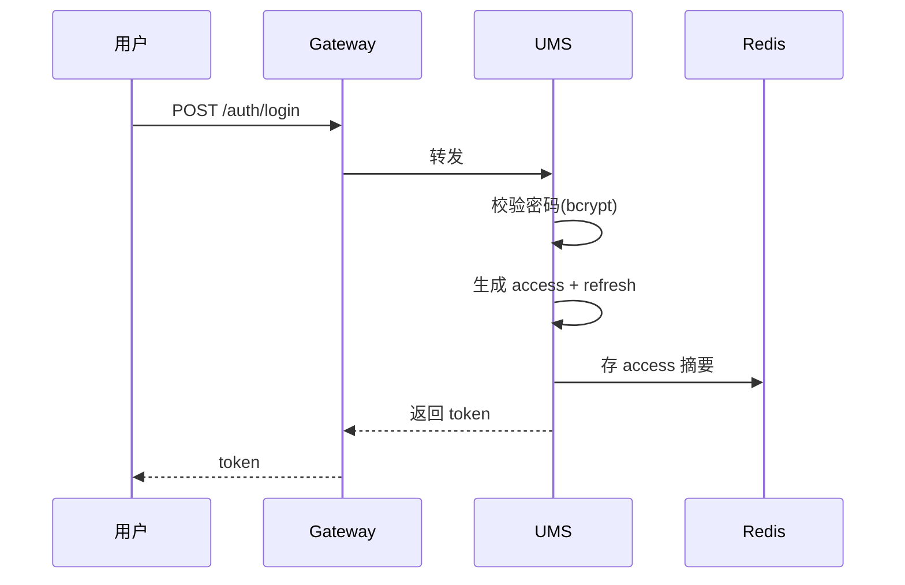
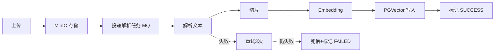

# 智擎 AI（InsightEngine）—— 技术方案设计（TD）

> 版本：v1.0（MVP）
> 撰写日期：2026-08-25
> 关联文档：PRD、IF（接口设计）、OPS（部署运维）、TS（测试用例，暂缓）
> 本文档是《PRD》的技术落地蓝本，回答"**怎么做**"的问题。所有设计决策均给出理由，形成可被面试追问时讲清楚的技术纵深。

---

## 目录

- 1. 文档信息与范围
- 2. 技术选型与版本锁定
- 3. 工程结构与模块依赖
- 4. 公共基础模块设计
- 5. 数据库设计
- 6. 缓存设计
- 7. 认证与鉴权设计
- 8. 微服务治理设计
- 9. 模型网关设计
- 10. 知识库（RAG）设计
- 11. Agent 编排设计
- 12. 消息队列（RabbitMQ）设计
- 13. 限流、配额与幂等
- 14. 可观测性设计
- 15. 事务与一致性
- 16. 安全设计
- 17. 性能优化
- 18. 部署设计
- 19. 关键技术决策记录（ADR）
- 20. 附录：踩坑清单与规避

---

## 1. 文档信息与范围

| 项 | 内容 |
|----|------|
| 目标 | 定义 MVP 阶段完整技术实现方案 |
| 读者 | 后端开发（主）、前端开发、运维 |
| 前置 | 已阅读 PRD |
| 交付物 | 可编译运行的 Maven 多模块工程 + 部署脚本 |

### 1.1 方案设计原则

1. **先单机、后集群**：MVP 全部服务可跑在单机 Docker Compose，但代码按微服务边界隔离，避免后续重构。
2. **接口优先**：先定义 OpenAPI 契约（见 IF），再实现，保证前后端并行。
3. **一切可观测**：每个请求带 `traceId`，每个错误可定位。
4. **一切可计量**：模型/工具/检索调用全部落用量记录。
5. **失败可重试、可降级**：外部依赖（大模型、网络）全部包裹重试 + 熔断。
6. **约定优于配置**：统一响应、统一异常、统一分页、统一错误码。

---

## 2. 技术选型与版本锁定

> 版本号以"稳定 GA"为准，实际落地时若最新 patch 有安全修复可小幅上浮；严禁跨主版本。

### 2.1 后端

| 组件 | 版本 | 说明 | 选型理由 |
|------|------|------|----------|
| Java | 17（MVP）/ 21（V1.0） | LTS | 17 与 Spring Boot 3 匹配；21 是当前 LTS，V1.0 平滑升级 |
| Spring Boot | 3.2.x | 主框架 | Boot 3 强制 Java 17，去 javax→jakarta，生态新 |
| Spring Cloud | 2023.0.x | 微服务 | 与 Boot 3.2 对齐 |
| Spring Cloud Alibaba | 2023.0.1.x | Nacos/Sentinel | 国内生态最成熟 |
| Spring AI | 1.0.x（GA） | AI 抽象 | 统一 ChatModel/EmbeddingModel，原生支持通义 |
| Spring AI Alibaba | 1.0.x | 通义适配 | 官方通义千问适配器 |
| LangChain4j | 1.x | Agent 补充 | 提供 AiServices、Tool 注解、ReAct 实现 |
| MyBatis-Plus | 3.5.7 | ORM | 免写 CRUD，分页、逻辑删除、拦截器丰富 |
| PostgreSQL | 15 | 主库 + 向量 | 一个库同时承担业务与向量，降低运维复杂度 |
| PGVector | 0.7.x | 向量扩展 | PostgreSQL 原生扩展，支持 ivfflat/hnsw |
| Redis | 7 | 缓存/会话/配额 | |
| RabbitMQ | 3.13（镜像 `rabbitmq:3.13-management`） | 消息 | 异步任务、事件、通知；宿主端口映射 5673/15673 |
| Nacos | 2.3.2 | 注册+配置 | |
| Sentinel | 1.8.6（alibaba 版本） | 限流熔断 | |
| JJWT | 0.12.x | JWT | |
| EasyExcel | 3.3.x | 账单导出 | |
| Hutool | 5.8.x | 工具 | |
| Knife4j | 4.5.x | 接口文档 | 兼容 OpenAPI3 |
| MinIO | RELEASE.2024 | 对象存储 | 文档/头像 |
| Micrometer | 1.12.x | 指标 | Prometheus registry |
| Lombok | 1.18.30+ | 提效 | |

### 2.2 前端

| 组件 | 版本 | 说明 |
|------|------|------|
| Vue | 3.4.x | |
| Vite | 5.x | |
| TypeScript | 5.4.x | |
| Arco Design Vue | 2.x | UI 组件库 |
| Pinia | 2.x | 状态 |
| Vue Router | 4.x | 路由 |
| Axios | 1.x | 请求 |
| Markdown-it | 14.x | 消息渲染 |
| ECharts | 5.x | 监控图表 |

### 2.3 大模型

| 供应商 | 模型 | 用途 |
|--------|------|------|
| 通义千问 | qwen-plus / qwen-turbo / qwen-max | 对话推理 |
| 通义 | text-embedding-v3 | Embedding |
| 通义 | qwen-rerank（或 bge-reranker-v2-m3） | Rerank |
| Ollama（本地） | qwen2.5:7b / llama3.1:8b | 本地无网对话 |
| Ollama | bge-m3 / nomic-embed-text | 本地 Embedding |
| 智谱 | glm-4 / glm-4-flash | 备选对话 |

> 策略：**对话模型可云端（通义）+ 本地（Ollama）双路；Embedding 默认云端 text-embedding-v3，离线环境回退 bge-m3**。

---

## 3. 工程结构与模块依赖

### 3.1 Maven 多模块结构

```
insight-engine/
├── pom.xml                                    # 父 POM（packaging=pom）
├── insight-engine-dependencies/               # BOM，统一依赖版本
├── insight-engine-common/                     # 纯公共：常量、枚举、工具、异常、DTO 基类
├── insight-engine-api/                        # Feign 接口定义 + 共享 DTO（跨服务契约）
├── insight-engine-starter/
│   ├── insight-engine-starter-web/            # 统一响应/异常/TraceID/日志
│   ├── insight-engine-starter-mybatis/        # MP 配置、逻辑删除、MetaObjectHandler、数据权限拦截器
│   ├── insight-engine-starter-security/       # Security 过滤链、JWT 工具、注解
│   ├── insight-engine-starter-redis/          # RedisTemplate 配置、分布式锁、缓存注解
│   ├── insight-engine-starter-nacos/          # 注册/配置中心启用
│   ├── insight-engine-starter-ai/             # Spring AI + LangChain4j Bean 装配
│   ├── insight-engine-starter-mq/             # RabbitMQ 配置、消息抽象
│   └── insight-engine-starter-observability/  # Micrometer 装配
└── insight-engine-modules/
    ├── insight-engine-gateway/                # Spring Cloud Gateway
    ├── insight-engine-ums/                    # 用户权限
    ├── insight-engine-workspace/              # 工作空间/组织
    ├── insight-engine-model/                  # 模型网关
    ├── insight-engine-kb/                     # 知识库
    ├── insight-engine-agent/                  # Agent
    ├── insight-engine-tool/                   # 工具市场
    ├── insight-engine-conv/                   # 对话
    ├── insight-engine-billing/                # 计费
    ├── insight-engine-obs/                    # 监控审计
    └── insight-engine-notify/                 # 通知
```

### 3.2 模块依赖方向（单向，禁止循环）

```
modules/* ──> api ──> common
modules/* ──> starter/* ──> common
```

规则：
- `common` 不依赖任何业务模块、不依赖 Spring Web（纯 POJO）
- `api` 定义 Feign 接口 + DTO，被多个服务依赖，避免服务间直接耦合
- 服务之间只能通过 `api` 的 Feign 接口调用，禁止直接引对方 `module` 内部类

### 3.3 统一依赖管理（BOM 摘要）

```xml
<dependencyManagement>
  <dependencies>
    <dependency>
      <groupId>org.springframework.boot</groupId>
      <artifactId>spring-boot-dependencies</artifactId>
      <version>3.2.5</version>
      <type>pom</type>
      <scope>import</scope>
    </dependency>
    <dependency>
      <groupId>org.springframework.cloud</groupId>
      <artifactId>spring-cloud-dependencies</artifactId>
      <version>2023.0.1</version>
      <type>pom</type>
      <scope>import</scope>
    </dependency>
    <dependency>
      <groupId>com.alibaba.cloud</groupId>
      <artifactId>spring-cloud-alibaba-dependencies</artifactId>
      <version>2023.0.1.0</version>
      <type>pom</type>
      <scope>import</scope>
    </dependency>
  </dependencies>
</dependencyManagement>
```

---

## 4. 公共基础模块设计

### 4.1 统一响应体

```java
@Data
public class Result<T> {
    private int code;        // 0 成功，非 0 失败
    private String message;
    private T data;
    private String traceId;
    private long ts = System.currentTimeMillis();
}
```

静态工厂：

```java
Result.ok(data)
Result.fail(errorCode, msg)
```

### 4.2 错误码体系

枚举 `ErrorCode`，码段规则见 PRD §9.4.2：

```java
public enum ErrorCode {
    SUCCESS(0, "ok"),
    PARAM_ERROR(1001, "参数错误"),
    UNAUTHORIZED(2001, "未登录"),
    PASSWORD_ERROR(2002, "密码错误"),
    ACCOUNT_LOCKED(2003, "账号已锁定"),
    ACCOUNT_DISABLED(2004, "账号已禁用"),
    FORBIDDEN(2006, "无权限"),
    MODEL_NOT_FOUND(3001, "模型不存在"),
    MODEL_TIMEOUT(3002, "模型调用超时"),
    MODEL_RATE_LIMIT(3003, "模型限流"),
    KB_NOT_FOUND(4001, "知识库不存在"),
    DOC_PARSE_FAIL(4002, "文档解析失败"),
    ...
}
```

### 4.3 统一异常

```java
public class BizException extends RuntimeException {
    private final int code;
    private final String message;
}
```

`GlobalExceptionHandler` 捕获顺序：

1. `BizException` → 返回对应 code/message
2. `MethodArgumentNotValidException` → `PARAM_ERROR`，带字段错误
3. `ConstraintViolationException` → `PARAM_ERROR`
4. `AccessDeniedException` → `FORBIDDEN`
5. `Exception` → `SYSTEM_ERROR(9999)`，打印堆栈

### 4.4 TraceID 全链路

```java
@Component
public class TraceFilter extends OncePerRequestFilter {
    doFilterInternal() {
        String traceId = request.getHeader("X-Trace-Id");
        if (traceId == null) traceId = IdUtil.fastSimpleUUID();
        MDC.put("traceId", traceId);
        response.setHeader("X-Trace-Id", traceId);
        chain.doFilter(...);
        MDC.clear();
    }
}
```

- Feign 客户端：`RequestInterceptor` 从 `MDC` 取 traceId 注入 `X-Trace-Id`
- logback pattern：`%d{yyyy-MM-dd HH:mm:ss.SSS} [%X{traceId}] [%thread] %-5level %logger{36} - %msg%n`

### 4.5 用户上下文

```java
public class UserContext {
    private static final ThreadLocal<LoginUser> HOLDER = new ThreadLocal<>();
    // set / get / clear
}
```

`LoginUser` 由网关解析 JWT 后通过 header 下发（`X-User-Id`, `X-Tenant-Id`, `X-Workspace-Id`, `X-Roles`），业务服务从 header 解析并填充 ThreadLocal。

> 说明：业务服务不重复解析 JWT，只信任网关下发的明文 header（内网可信）。降低每服务对 secret 的依赖，简化运维。

### 4.6 分页封装

```java
public class PageQuery {
    private int pageNum = 1;
    private int pageSize = 10;   // 上限 100
}
public class PageResult<T> {
    private List<T> records;
    private long total;
    private int pageNum;
    private int pageSize;
}
```

---

## 5. 数据库设计

### 5.1 命名与字段规范

- 表前缀 `ie_`，字段蛇形，实体驼峰（MP 自动映射）
- 主键：`BIGSERIAL`（自增），不使用 UUID（索引性能）
- 业务唯一键：编码类字段 + 租户/组织维度唯一索引
- 审计字段：`created_at` / `updated_at` / `created_by` / `updated_by`
- 逻辑删除：`deleted`（0 正常 / 1 删除），MP 全局配置 `logic-delete-field: deleted`
- 金额：`DECIMAL(18,6)`，不使用浮点
- 时间：`TIMESTAMP`（不带时区，统一 UTC，展示层转换）
- JSON：`JSONB`（PostgreSQL），仅用于非检索字段

### 5.2 库表创建顺序（init.sql）

依赖顺序（先主表后从表、先无外键后有外键）：

```
1. ie_user / ie_organization / ie_workspace / ie_member
2. ie_role / ie_permission / ie_role_permission
3. ie_model_vendor / ie_model / ie_route_policy
4. ie_prompt_template / ie_prompt_example / ie_prompt_debug_record
5. ie_knowledge_base / ie_document / ie_chunk
6. ie_agent / ie_agent_tool / ie_agent_kb / ie_agent_invocation
7. ie_tool / ie_tool_invocation
8. ie_conv / ie_message
9. ie_quota / ie_usage_record / ie_bill / ie_bill_item
10. ie_audit_log / ie_notification_*
11. ie_dict / ie_dict_item / ie_sys_config
```

### 5.3 索引策略

| 表 | 索引 | 类型 | 说明 |
|----|------|------|------|
| ie_user | idx_user_tenant | btree | 租户过滤 |
| ie_workspace | uk_ws_code_org | unique | 编码唯一 |
| ie_member | idx_member_user | btree | 按用户查所属空间 |
| ie_model | uk_model_vendor_code | unique | |
| ie_document | idx_doc_kb | btree | 按 KB 查文档 |
| ie_chunk | idx_chunk_kb_doc | btree | 按 KB/doc 查 chunk |
| ie_chunk | ivfflat/hnsw | vector | 向量检索 |
| ie_message | idx_msg_conv | btree | 按会话查消息 |
| ie_usage_record | idx_usage_scope_time | btree | 用量按时间聚合 |
| ie_audit_log | idx_audit_time | btree | 审计按时间 |

### 5.4 PGVector 索引选择（关键决策）

**结论**：MVP 使用 `ivfflat`，数据规模 > 100 万 chunk 时迁移 `hnsw`。

理由：
- `ivfflat`：构建快、内存小，查询需 `SET ivfflat.probes` 调优，召回率依赖 probes；适合中小规模、快速上线。
- `hnsw`：召回率/延迟更优，但构建慢、内存大、不支持增量删除友好。
- MVP 数据量小（≤ 50 万 chunk），ivfflat 足够，且能省内存。

DDL：

```sql
-- 向量维度 1024（text-embedding-v3 为 1024）
CREATE EXTENSION IF NOT EXISTS vector;
CREATE TABLE ie_chunk (
  ...
  embedding vector(1024)
);
CREATE INDEX ON ie_chunk USING ivfflat (embedding vector_cosine_ops) WITH (lists = 100);
```

查询：

```sql
SELECT id, content, metadata, 1 - (embedding <=> :q) AS score
FROM ie_chunk
WHERE kb_id = :kbId
  AND metadata @> :filter::jsonb
ORDER BY embedding <=> :q
LIMIT :topK;
```

> 注意：`metadata @> :filter` 与向量索引并存时，PG 会选择 ivfflat 或顺序扫描；大量 metadata 过滤时建议：先向量召回 TopK*4，再在应用层做 metadata 过滤（本项目采用"先召回后过滤"策略，见 §10.6）。

### 5.5 逻辑删除与唯一索引冲突

- 逻辑删除字段 `deleted`，唯一索引需要把 `deleted` 纳入（PostgreSQL 支持部分唯一索引）：

```sql
CREATE UNIQUE INDEX uk_ws_code_org ON ie_workspace(org_id, code) WHERE deleted = 0;
```

---

## 6. 缓存设计

### 6.1 Key 命名规范

格式：`ie:{domain}:{entity}:{id}` 或 `ie:{domain}:{biz}:{scope}:{id}`

| Key | 类型 | TTL | 说明 |
|-----|------|-----|------|
| `ie:auth:token:{userId}` | string | 2h | 登录态（值为 token 摘要） |
| `ie:auth:blacklist:{tokenHash}` | string | token 剩余有效期 | 登出黑名单 |
| `ie:user:info:{userId}` | hash | 30min | 用户缓存 |
| `ie:role:permissions:{roleId}` | set | 10min | 角色权限 |
| `ie:ws:member:{workspaceId}` | set | 10min | 空间成员 userId |
| `ie:model:list:enabled` | string(json) | 5min | 启用模型列表 |
| `ie:kb:meta:{kbId}` | string(json) | 30min | KB 元信息 |
| `ie:quota:used:{scopeType}:{scopeId}:{type}` | string | 周期内 | 配额已用（incr） |
| `ie:rate:{modelId}:{userId}` | string | 60s 窗口 | 限流计数 |
| `ie:lock:{biz}:{id}` | string | 30s | 分布式锁 |

### 6.2 三大问题防护

- **穿透**：空结果缓存 60s（存 `"null"` 占位）
- **击穿**：热点 key 用 `Redis 分布式锁 + 单飞（singleflight）`，只有一个线程回源
- **雪崩**：TTL 加随机抖动（±10%）

### 6.3 分布式锁

用 Redisson 或 SETNX + Lua 释放，封装 `@RedisLock(key = "ie:lock:#{biz}:#{id}", waitTime=3, leaseTime=30)`。

### 6.4 缓存一致性

- 写后删除策略（Cache Aside）：先更 DB，再删 Redis
- 延迟双删兜底（MQ 异步再删一次）
- 缓存不做过期强依赖，所有缓存都是"可丢"的，DB 是唯一事实源

---

## 7. 认证与鉴权设计

### 7.1 认证流程



### 7.2 JWT 载荷

```json
{
  "sub": 10001,
  "tenant_id": 1,
  "ws_id": 1,
  "roles": ["ws_admin"],
  "iat": 1724567890,
  "exp": 1724575090
}
```

- Access Token 2h；Refresh Token 7d
- 刷新接口：`POST /auth/refresh`（body 传 refresh_token）

### 7.3 Spring Security 配置

```java
@Bean
SecurityFilterChain filterChain(HttpSecurity http) {
    http.csrf(AbstractHttpConfigurer::disable)
        .sessionManagement(s -> s.sessionCreationPolicy(STATELESS))
        .authorizeHttpRequests(a -> a
            .requestMatchers("/auth/login", "/auth/refresh", "/v3/api-docs/**", "/doc.html").permitAll()
            .anyRequest().authenticated())
        .addFilterBefore(jwtAuthFilter, UsernamePasswordAuthenticationFilter.class);
    return http.build();
}
```

### 7.4 方法级权限

```java
@PreAuthorize("hasAuthority('kb:read')")
```

### 7.5 数据权限（ABAC）

MyBatis-Plus 拦截器实现行级隔离：

```java
@Intercepts({@Signature(type = Executor.class, method = "query", args = {...})})
public class DataScopeInterceptor implements InnerInterceptor {
    // 根据 UserContext 的 workspaceId/roles 动态追加 WHERE 条件
    // SELECT * FROM ie_kb WHERE (deleted=0) AND (workspace_id = ? )
}
```

规则：
- `super_admin`：不过滤
- `org_admin`：过滤 `org_id = 当前组织`
- 其他角色：过滤 `workspace_id = 当前空间`（或 `created_by = 当前用户`，视资源 scope）

### 7.6 API Key 鉴权（OpenAPI 通道）

- 请求头 `Authorization: Bearer sk-ins-xxx`（与 JWT 区分：网关检测前缀 `sk-` 走 API Key 校验）
- API Key 关联 workspace，权限范围 = workspace 内受限制的只读调用
- API Key 限流见 §13

---

## 8. 微服务治理设计

### 8.1 服务注册（Nacos）

- 每个业务服务 `application.yml`：

```yaml
spring:
  cloud:
    nacos:
      discovery:
        server-addr: ${NACOS_ADDR:127.0.0.1:8848}
      config:
        server-addr: ${NACOS_ADDR:127.0.0.1:8848}
        file-extension: yaml
```

- 配置中心存储公共配置（数据源、Redis、MQ），服务启动拉取

### 8.2 服务调用（OpenFeign）

`insight-engine-api` 定义接口：

```java
@FeignClient(name = "insight-engine-kb", contextId = "kbClient")
public interface KbClient {
    @PostMapping("/api/v1/kb/{kbId}/retrieve")
    Result<RetrieveResult> retrieve(@PathVariable("kbId") Long kbId, @RequestBody RetrieveRequest req);
}
```

- 超时：连接 3s，读取 10s（大模型调用走独立长超时配置 120s）
- 重试：仅对幂等 GET/POST-retrieve 开启
- 熔断：`sentinel` 兜底

### 8.3 网关（Spring Cloud Gateway）

路由配置（示例）：

```yaml
spring:
  cloud:
    gateway:
      routes:
        - id: ums
          uri: lb://insight-engine-ums
          predicates: [Path=/auth/**, /api/v1/user/**, /api/v1/role/**]
        - id: kb
          uri: lb://insight-engine-kb
          predicates: [Path=/api/v1/kb/**]
        - id: model
          uri: lb://insight-engine-model
          predicates: [Path=/api/v1/model/**]
        ...
```

全局过滤器链顺序：

1. `TraceFilter`（traceId）
2. `AuthGlobalFilter`（JWT/API Key 校验，写 UserContext 头）
3. `RateLimitGlobalFilter`（Sentinel 网关限流）
4. `CorsWebFilter`（跨域）

### 8.4 跨域

```java
@Bean
CorsWebFilter corsFilter() {
    CorsConfiguration c = new CorsConfiguration();
    c.addAllowedOriginPattern("*");     // MVP 放开，生产用白名单
    c.addAllowedHeader("*");
    c.addAllowedMethod("*");
    c.setAllowCredentials(true);
    return new CorsWebFilter(new UrlBasedCorsConfigurationSource(){{ registerCorsConfiguration("/**", c); }});
}
```

---

## 9. 模型网关设计

### 9.1 分层抽象（核心）

```java
// 统一对话模型抽象（复用 Spring AI）
public interface ChatModel {
    ChatResponse call(Prompt prompt);
    Flux<ChatResponse> stream(Prompt prompt);
}
```

自研适配器统一包装（对接 Spring AI + LangChain4j 两套）：

```java
public interface ChatAdapter {
    boolean supports(String vendorCode);
    ChatResult chat(ChatRequest req);
    Flux<String> stream(ChatRequest req);
    EmbeddingResult embed(List<String> inputs);
    List<Double> rerank(String query, List<String> docs, int topN);
}
```

实现：

```
TongyiChatAdapter
OllamaChatAdapter
ZhipuChatAdapter
OpenAICompatChatAdapter   // 兼容 OpenAI 协议（DeepSeek/Moonshot/Kimi）
```

### 9.2 模型路由

```java
public class ModelRouter {
    ChatAdapter route(ChatRequest req) {
        // 1. 解析 req.model（'auto' 时走策略）
        // 2. 加载 RoutePolicy DSL
        // 3. 命中规则 → 返回目标适配器
        // 4. 未命中 → 默认模型
    }
}
```

路由策略实现（枚举 + 策略模式）：

- `WeightedRoutingStrategy`：加权随机（带权重缓存）
- `PriorityRoutingStrategy`：按优先级顺序，失败下探
- `FallbackRoutingStrategy`：主模型失败切换到 fallback 链

### 9.3 流式输出（SSE）

```java
@PostMapping(value = "/chat/completions", produces = MediaType.TEXT_EVENT_STREAM_VALUE)
public Flux<ServerSentEvent<String>> chatStream(...) {
    return adapter.stream(req)
        .map(chunk -> ServerSentEvent.builder(chunk).event("message").build())
        .onErrorResume(e -> Flux.just(ServerSentEvent.builder(...).event("error").build()));
}
```

Spring WebFlux 响应式流式输出；网关层配置 `spring.cloud.gateway.httpclient.websocket` 与超时。

### 9.4 用量计量

```java
@Around("@annotation(MeasureModel)")
public Object measure(ProceedingJoinPoint pjp) {
    // 记录 startTime
    // 调用后读取 usage（promptTokens/completionTokens）
    // 异步上报（MQ）到 billing
    // 记录 ModelUsageRecord
}
```

- 同步响应：从 response.usage 读
- 流式响应：chunk 累加（末 chunk 带 usage）
- 异步上报：RabbitMQ，避免拖慢主链路

### 9.5 模型超时与重试

- 超时：同步 60s，流式首包 15s、整体 120s
- 重试：仅对网络类错误（超时/连接拒绝），最多 2 次，指数退避（1s、2s）
- 熔断：Sentinel，`slowRatioThreshold` / `异常比例` 熔断，半开探测

---

## 10. 知识库（RAG）设计

### 10.1 文档解析流水线



### 10.2 解析器（策略模式）

```java
public interface DocumentParser {
    boolean supports(String ext);
    ParseResult parse(InputStream in);
}
```

实现：`PdfParser`（Apache PDFBox）、`WordParser`（Apache POI）、`MarkdownParser`、`TxtParser`、`CsvParser`、`HtmlParser`（jsoup）。

### 10.3 切片策略

```java
public interface Chunker {
    List<Chunk> chunk(String text, ChunkConfig cfg);
}
```

- `FixedChunker`：定长 + 重叠
- `SentenceChunker`：按句号/换行
- `MarkdownHeaderChunker`：按 H1/H2/H3 层级，标题携带到子 chunk 元数据
- 默认组合：Markdown 按标题，无标题回退 Sentence，兜底 Fixed

### 10.4 Embedding 批处理

- 每批 32 条，调用 `text-embedding-v3`
- 失败重试 3 次，指数退避
- 批次内幂等（chunk 唯一键 = `doc_id + idx`）

### 10.5 检索流程（先召回后过滤）

```
query → Embedding → 向量召回 TopK*4 → [应用层 metadata 过滤] → [可选 Rerank] → TopK
```

- 向量召回用 PGVector `<=>` 余弦距离
- 混合检索（V1.0）：BM25（pg_trgm / 自研倒排）与向量结果 RRF 融合
- Rerank：`qwen-rerank` 或本地 bge-reranker，对 TopK*2 重排

### 10.6 metadata 过滤

- 上传文档时注入：`docId`, `kbId`, `page`, `title`, `sourceType`
- 自定义字段：`dept`, `category` 等（V1.0）
- 过滤在应用层做，避免 PG 向量 + jsonb 索引组合选择问题

### 10.7 引用溯源

- 检索返回的每个 chunk 携带 `{chunkId, docId, docName, page, content, score}`
- Agent 组装最终答案时，将引用 chunk 的 `docName/page` 附在响应

---

## 11. Agent 编排设计

### 11.1 Agent 执行核心抽象

```java
public interface AgentStrategy {
    AgentResult execute(AgentContext ctx);
}
```

- `FunctionCallingStrategy`（MVP）：单轮 prompt + 工具 schema 注入，依赖模型原生 Function Calling
- `ReActStrategy`（MVP）：Thought-Action-Observation 循环
- `PlanExecuteStrategy`（V1.0）：先规划任务列表再逐步执行

### 11.2 ReAct 实现要点

```java
public class ReActStrategy implements AgentStrategy {
    public AgentResult execute(AgentContext ctx) {
        List<Message> msgs = new ArrayList<>(ctx.messages);
        for (int i = 0; i < ctx.maxIter; i++) {
            ChatResult r = model.chat(msgs + toolSchemas);
            if (r.hasToolCall()) {
                ToolResult tr = toolInvoker.invoke(r.toolCall);
                msgs.add(assistant(toolCall));
                msgs.add(observation(tr));   // role: tool
            } else {
                return finalize(r.content, collectReferences());
            }
        }
        throw new BizException(AGENT_MAX_ITER, "超过最大迭代次数");
    }
}
```

### 11.3 Function Calling 工具 Schema

```java
@Tool(name = "leave.query", description = "查询员工年假余额")
public String queryLeave(@P("userId") String userId) { ... }
```

使用 LangChain4j `@Tool` 注解定义，运行时反射生成 JSON Schema 注入 prompt。

### 11.4 工具调用器

```java
public class ToolInvoker {
    public ToolResult invoke(ToolCall call) {
        // 1. 校验工具存在、启用
        // 2. 配额/限流检查
        // 3. 分发：HTTP / 内置 / 函数 / DB
        // 4. 记录 ToolInvocation + 用量
        // 5. 超时/异常包裹
    }
}
```

### 11.5 工作流引擎（V1.0）

- 自研轻量状态机执行器，DSL 见 PRD §12.7.7
- 节点执行器注册表：`type -> NodeExecutor`
- 支持：LLM / Tool / KB / HTTP / 条件 / 循环 / 赋值 / 代码 / 注释
- 画布状态（执行中节点高亮）通过 WebSocket/SSE 推送前端

### 11.6 Agent 版本化

- 每次保存生成版本快照（JSON）
- 发布 = 将某个版本标记为 `LIVE`
- 调用默认走 `LIVE`，调试走 `DRAFT`

---

## 12. 消息队列（RabbitMQ）设计

### 12.1 交换机与队列拓扑

| 交换机 | 类型 | 队列 | 路由键 | 用途 |
|--------|------|------|--------|------|
| `ie.exchange.doc` | topic | `ie.queue.doc.parse` | `doc.parse` | 文档解析 |
| `ie.exchange.embed` | topic | `ie.queue.embed.batch` | `embed.batch` | 批量向量化 |
| `ie.exchange.usage` | topic | `ie.queue.usage.record` | `usage.*` | 用量上报 |
| `ie.exchange.audit` | topic | `ie.queue.audit.log` | `audit.*` | 审计留痕 |
| `ie.exchange.notify` | topic | `ie.queue.notify.send` | `notify.*` | 通知投递 |
| `ie.exchange.bill` | topic | `ie.queue.bill.generate` | `bill.generate` | 账单生成 |

### 12.2 消息格式（统一信封）

```json
{
  "eventId": "uuid",
  "eventType": "doc.parse",
  "occurredAt": 1724567890123,
  "traceId": "xxx",
  "tenantId": 1,
  "workspaceId": 1,
  "payload": { ... }
}
```

### 12.3 可靠性

- **生产者确认**：`publisher-confirm-type: correlated` + `publisher-returns`
- **消费者确认**：手动 ACK，处理成功 `basicAck`，失败 `basicNack` 重投
- **持久化**：队列/消息 `durable`

### 12.4 重试与死信

```yaml
spring:
  rabbitmq:
    listener:
      simple:
        acknowledge-mode: manual
        retry:
          enabled: true
          max-attempts: 3
          initial-interval: 2000
          multiplier: 2
```

- 3 次重试后进入死信队列 `ie.queue.doc.parse.dlq`
- 死信消费者：更新文档状态为 `FAILED` + 记录 `error_msg` + 发审计
- 幂等：消费端以 `eventId` 或业务唯一键（`docId+idx`）去重

### 12.5 幂等设计

- 消费端：`eventId` 存 Redis `SETNX`，存在则跳过（TTL 24h）
- 写库端：`INSERT ... ON CONFLICT DO NOTHING`（唯一键冲突忽略）
- 账单/用量：唯一键 `(scopeId, bizType, refId, period)`

---

## 13. 限流、配额与幂等

### 13.1 限流（Sentinel）

三层限流：

| 层 | 维度 | 规则示例 |
|----|------|----------|
| 网关 | IP | 单 IP 100 QPS |
| 网关 | 接口 | `/chat/completions` 200 QPS |
| 服务 | 租户+模型 | 单租户单模型 20 QPS |
| 服务 | 用户 | 单用户 5 QPS |

Sentinel 规则通过 Nacos 配置中心动态下发。

### 13.2 配额检查

```java
@RedisRateLimiter / 令牌桶：
key = ie:quota:used:{scopeType}:{scopeId}:{type}
limit = 从 ie_quota 读
```

- 每次调用 `INCR`，若超过 limit 则拒绝（code=429 / 8001）
- 周期重置：自然月/日，`resetAt` 到点归零（懒删除 + 定时任务）

### 13.3 幂等（写接口）

- 创建类接口：前端生成 `requestId`（UUID）提交，服务端 `SETNX ie:idem:{requestId}` 去重
- 支付/计费类：唯一键约束兜底

---

## 14. 可观测性设计

### 14.1 指标（Micrometer → Prometheus）

```yaml
management:
  endpoints:
    web:
      exposure:
        include: health,info,prometheus,metrics
  metrics:
    tags:
      application: ${spring.application.name}
```

自定义指标（通过 `MeterRegistry` 埋点）：

| 指标 | 类型 |
|------|------|
| `ie_request_total` | counter |
| `ie_request_latency_seconds` | timer |
| `ie_model_tokens_total` | counter |
| `ie_agent_invoke_total` | counter |
| `ie_tool_invoke_total` | counter |
| `ie_kb_retrieve_total` | counter |
| `ie_usage_cost_total` | counter |

### 14.2 日志规范

- 统一 slf4j + logback，输出 JSON 格式（生产）
- 关键日志：
  - 请求入参/出参（脱敏后）
  - 模型调用（模型名、token、延时、traceId）
  - 工具调用（工具名、参数、结果、延时）
  - 慢查询（> 200ms）
  - 异常堆栈（含 traceId）

### 14.3 调用链

- traceId 贯穿网关 → 服务 → 模型 → 工具
- 每次 Agent 调用生成 `agentInvocationId`，关联模型调用与工具调用
- 前端展示调用链时间轴（`/obs/trace/{traceId}`）

---

## 15. 事务与一致性

### 15.1 本地事务

- 单服务内用 `@Transactional`（`REQUIRED`，回滚 `Exception`）
- 事务内不做远程调用（避免长事务），远程调用放事务外

### 15.2 跨服务一致性（最终一致）

本项目涉及跨服务的写场景：文档上传 → 解析 → 向量化 → 状态更新。

方案：**本地消息表 + 事务消息（简化版）**：

```java
@Transactional
public void uploadDocument(Document doc) {
    documentMapper.insert(doc);          // 落库
    outboxMapper.insert(Outbox.of(doc)); // 本地消息表
    // 事务提交后，定时任务扫描 outbox 投递 MQ（保证不丢）
}
```

- Outbox 表 + 定时扫描 + 投递成功标记，保证至少一次投递
- 消费端幂等保证最终一致

### 15.3 分布式锁使用场景

- 文档重复解析（`ie:lock:doc:parse:{docId}`）
- 账单重复生成（`ie:lock:bill:{scopeId}:{period}`）
- 配额重置（`ie:lock:quota:reset:{scopeId}`）

---

## 16. 安全设计

### 16.1 密码与密钥

- 密码：BCrypt（`BCryptPasswordEncoder`，strength=10）
- 模型 API Key：AES-256-GCM 加密存储，主密钥（KEK）放环境变量/Secret 管理
- API Key（平台签发）：存储哈希（SHA-256），不存明文

### 16.2 文件安全

- 上传类型白名单：pdf/docx/md/txt/csv/html
- 大小限制：50MB（网关 + 服务双重校验）
- 存储 MinIO，访问用预签名 URL（`presignedGetObject`，7 天）
- 文件流式读取解析，不落临时明文（或解析后删除）

### 16.3 接口安全

- 所有写接口参数校验（`@Valid` + JSR-303）
- 输出脱敏（手机号、邮箱、密钥）
- 防 XSS：前端 sanitize + 后端富文本白名单
- 防注入：MyBatis `#{}` 参数化，禁止 `${}` 拼接用户输入

### 16.4 内容安全（V1.0）

- 接入敏感词库（`ie_sensitive_word`）
- 输入拦截（对话前）+ 输出拦截（对话后）
- 命中后走人工审核队列

---

## 17. 性能优化

| 优化点 | 手段 |
|--------|------|
| 检索性能 | PGVector ivfflat + probes 调优 + chunk 结果缓存 |
| 对话性能 | 流式输出 + 首包优化 + 上下文压缩 |
| 列表查询 | 分页 + 覆盖索引 + 冗余常用字段 |
| 模型调用 | 连接池复用（WebClient）+ 并发限制 |
| 文件解析 | 异步 + 批处理 + 并行度控制 |
| 前端 | 路由懒加载 + 虚拟滚动（会话列表）+ 组件缓存 |

---

## 18. 部署设计

### 18.1 Docker Compose 拓扑

见 PRD §17.1。关键点：

- 后端服务统一基础镜像 `eclipse-temurin:17-jre`，`Dockerfile` 多阶段构建
- 前端 `node:20-alpine` 构建 → `nginx:alpine` 运行
- `depends_on` + `healthcheck` 保证启动顺序
- 环境变量注入配置（`${NACOS_ADDR}` 等）

### 18.2 端口规划与冲突规避（重要）

#### 18.2.1 核心原则：区分「容器内端口」与「宿主映射端口」

Docker 端口映射 `"宿主机:容器"` 中，两段含义完全不同：

| 端口类型 | 含义 | 谁能改 |
|----------|------|--------|
| **容器内端口**（冒号右边） | 进程在容器内监听的端口，固定不变 | 永远不改 |
| **宿主映射端口**（冒号左边） | 宿主机上暴露的端口，供本机访问 | 按需改，避开冲突 |

**关键结论**：

1. **微服务之间**走 docker-compose 内部网络，用 `服务名:容器内端口`（如 `rabbitmq:5672`）通信，**完全不经过宿主端口**，所以宿主端口冲突不影响服务间通信。
2. **宿主映射端口**只服务于"宿主机直连"场景：本机 IDE 直连调试、浏览器打开管理界面。
3. 因此，**本机已有服务占用某宿主端口时，只需改项目 docker-compose 的宿主映射端口，容器内端口保持不变**。

#### 18.2.2 本机端口占用现状（阶段 0 已发现）

| 中间件 | 本机现状 | 冲突 |
|--------|----------|------|
| RabbitMQ | 已有 `rabbitmq:4.2` 容器，占用宿主 5672/15672 | ✅ 与本项目 5672/15672 冲突 |
| 其他（PostgreSQL/Redis/Nacos/MinIO 等） | 待阶段 2 逐一确认 | 待定 |

#### 18.2.3 本项目宿主端口规划（项目专属，统一避开本机占用）

> 规则：**容器内端口保持不变，宿主端口统一加偏移，形成项目专属端口段**，避免与本机任何已有服务冲突。

| 服务 | 容器内端口 | 本项目宿主映射端口 | 说明 |
|------|-----------|------------------|------|
| rabbitmq | 5672 / 15672 | **5673 / 15673** | 避开本机 4.2（5672/15672） |
| postgres | 5432 | **5433** | 避开本机可能已装的 PG 5432 |
| redis | 6379 | **6380** | 避开本机可能已装的 Redis 6379 |
| nacos | 8848 / 9848 | **8850 / 9850** | 避开默认 8848 |
| minio | 9000 / 9001 | **9010 / 9011** | 避开默认 9000 |
| prometheus | 9090 | **9091** | 避开默认 9090 |
| grafana | 3000 | **3001** | 避开默认 3000 |

#### 18.2.4 docker-compose 端口写法（RabbitMQ 示例）

```yaml
services:
  rabbitmq:
    image: rabbitmq:3.13-management      # 锁定 3.13，与 TD 版本表一致
    container_name: insight-rabbitmq
    ports:
      - "5673:5672"      # 宿主 5673 → 容器 5672（AMQP，本机 IDE 直连用）
      - "15673:15672"    # 宿主 15673 → 容器 15672（管理界面）
    environment:
      RABBITMQ_DEFAULT_USER: insight
      RABBITMQ_DEFAULT_PASS: insight123
    healthcheck:
      test: ["CMD", "rabbitmq-diagnostics", "ping"]
      interval: 10s
      timeout: 5s
      retries: 5
```

微服务内部连接配置（走内部网络，用容器名 + 容器内端口）：

```yaml
# 业务服务 application.yml
spring:
  rabbitmq:
    host: rabbitmq          # compose 服务名
    port: 5672              # 容器内端口（不是 5673！）
    username: insight
    password: insight123
```

本机 IDE 直连调试时（不打容器、直接跑本地 jar）：

```yaml
# 本地 application-local.yml
spring:
  rabbitmq:
    host: localhost
    port: 5673              # 走宿主映射端口
```

#### 18.2.5 RabbitMQ 版本 3.13 vs 4.2 的说明

| 项 | 3.13 | 4.x（4.2） |
|----|------|-----------|
| AMQP 0-9-1 协议 | 兼容 | 兼容（客户端无感知） |
| Spring AMQP 兼容 | 官方兼容（Boot 3.2 配 spring-amqp 3.1.x） | 兼容，但 4.0 有 breaking changes |
| 风险 | 无 | 4.0 移除了部分 deprecated 特性（classic mirroring 等） |

**决策**：本项目**独立起 `rabbitmq:3.13-management`**，不复用本机 4.2 容器。理由：项目环境隔离、版本受控、可复现；避免与现有项目耦合、避免 4.0 breaking changes 的不确定性。本项目只用基础交换机/队列/死信，3.13 完全够用。

### 18.3 Dockerfile（后端示例）

```dockerfile
FROM maven:3.9-eclipse-temurin-17 AS build
WORKDIR /app
COPY . .
RUN mvn clean package -DskipTests

FROM eclipse-temurin:17-jre
WORKDIR /app
COPY --from=build /app/insight-engine-modules/insight-engine-ums/target/*.jar app.jar
ENTRYPOINT ["java", "-jar", "app.jar"]
```

### 18.4 初始化

- `init.sql` 挂载到 postgres `/docker-entrypoint-initdb.d/`
- `seed 数据`：管理员账号、权限字典、内置工具
- 首次启动后访问 `http://localhost:7200` 管理端

---

## 19. 关键技术决策记录（ADR）

| # | 决策 | 备选 | 理由 |
|---|------|------|------|
| ADR-1 | 向量库选 PGVector 而非 Milvus/Qdrant | Milvus / Qdrant / Elasticsearch | MVP 单机、复用 PostgreSQL、少一个中间件；数据量 < 百万时 PGVector 足够 |
| ADR-2 | 主库选 PostgreSQL 而非 MySQL | MySQL | PGVector 集成、JSONB、部分索引，满足向量+业务统一 |
| ADR-3 | AI 框架 Spring AI 为主、LangChain4j 为辅 | 只用其一 | Spring AI 与 Spring 生态天然集成；LangChain4j 工具注解/ReAct 更成熟 |
| ADR-4 | 工作流自研状态机，不引 Flowable | Flowable/Activiti | LLM 工作流是"数据流"不是"审批流"，BPM 引擎过重，自研可控 |
| ADR-5 | 网关下发明文用户 header，服务不再解析 JWT | 每服务解析 JWT | 内网可信 + 简化 secret 分发 + 性能 |
| ADR-6 | 用量上报走 MQ 异步 | 同步写库 | 不拖慢主链路，削峰，最终一致 |
| ADR-7 | 检索"先召回后过滤" | 全 SQL 过滤 | 规避 PG 向量索引与 jsonb 组合选错索引的问题 |
| ADR-8 | ivfflat 起步，规模化转 hnsw | 直接 hnsw | 省内存、构建快，MVP 够用 |
| ADR-9 | SSE 流式而非 WebSocket | WebSocket | 单向流式场景 SSE 更简单、兼容代理 |
| ADR-10 | JWT 存 Redis 摘要 + 黑名单 | 无状态纯 JWT | 支持主动登出/踢人，同时保留无状态校验 |
| ADR-11 | 中间件宿主端口统一加偏移（RabbitMQ 5673/15673 等），容器内端口不变 | 直接复用默认宿主端口 / 复用本机已有容器 | 本机已有 rabbitmq:4.2 占用 5672/15672；容器内端口固定、服务间走内部网络，宿主端口仅用于本机调试，改映射即可隔离 |
| ADR-12 | RabbitMQ 锁定 3.13-management，不复用本机 4.2 | 复用本机 4.2 容器 | 项目环境隔离、版本受控可复现；4.0 有 breaking changes，本项目无需 4.x 特性 |

---

## 20. 附录：踩坑清单与规避

| 坑 | 现象 | 规避 |
|----|------|------|
| PGVector 与 jsonb 过滤组合慢 | 检索延迟高 | 先召回后过滤（ADR-7） |
| 大模型流式 chunk 粘包 | SSE 输出乱序/丢行 | 按 `\n\n` 分帧，单事件 `data:` 多行合并 |
| RabbitMQ 消费者重复消费 | 幂等问题 | eventId 去重 + ON CONFLICT |
| Feign 调用大模型超时 | 网关 504 | 独立 feign client，readTimeout 120s |
| Token 计量不准 | 账单偏差 | 以模型返回 usage 为准，末 chunk 必含 usage |
| 文档解析 OOM | 大 PDF 内存暴涨 | 流式解析 + 大小限制 + 独立 worker 容器 |
| 逻辑删除后唯一索引冲突 | 同名重建失败 | 部分唯一索引（WHERE deleted=0） |
| Nacos 配置缓存不刷新 | 配置不生效 | 配置中心 + `@RefreshScope` + 监听 |
| 前端流式中文乱码 | 显示乱码 | `Content-Type: text/event-stream; charset=utf-8` |

---

> **TD 结束。下一步交付《IF-接口设计》**，包含每个接口的完整定义、字段、错误码、curl 示例。
