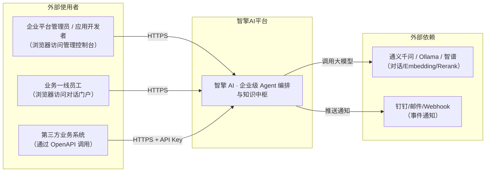
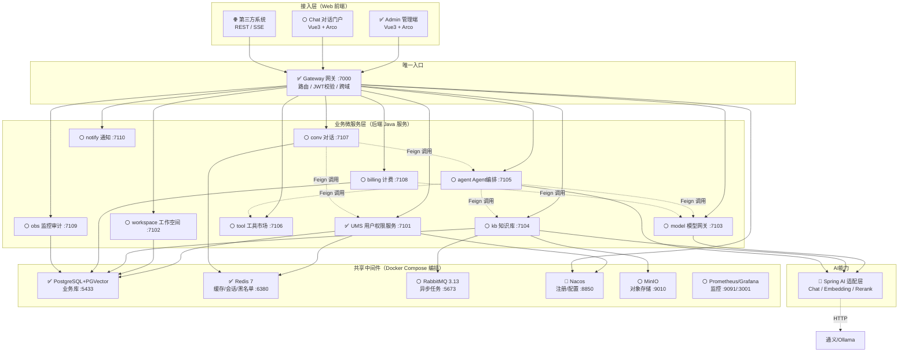
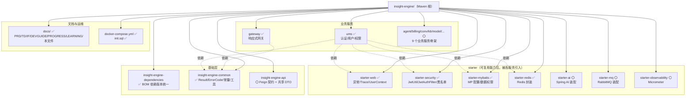
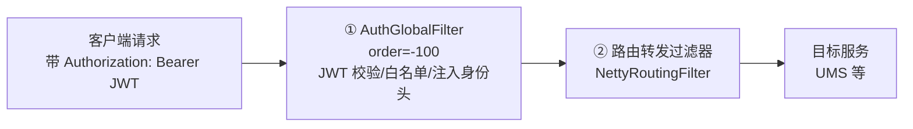
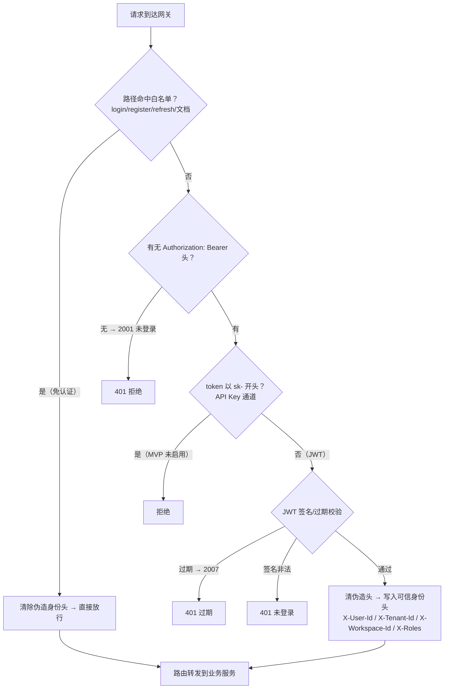
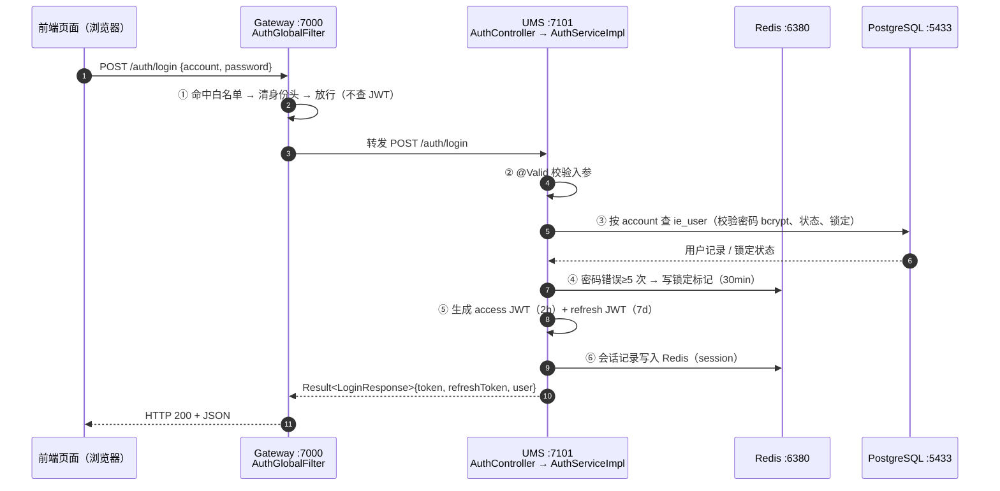
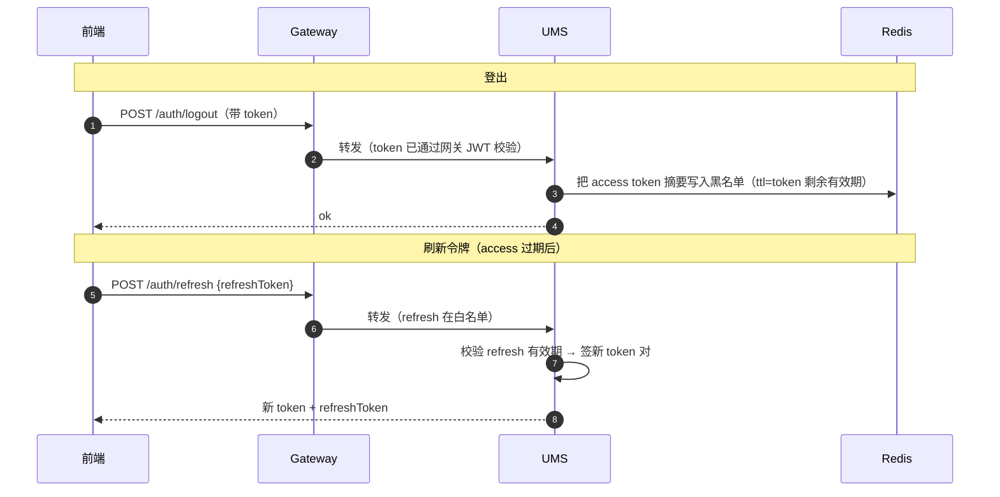
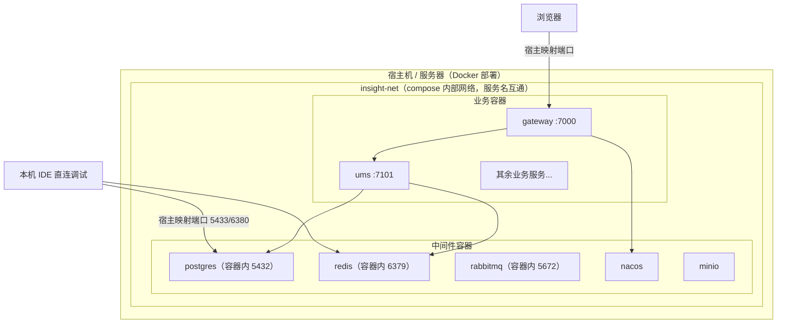

# 智擎 AI（InsightEngine）—— 架构设计总览：从总览到局部

> 版本：v1.0
> 日期：2026-09-08
> 读者：项目开发者本人（后端为主，需快速建立"系统长什么样、请求从哪到哪"的整体认知）
> 定位：本文件是**架构视图的唯一入口**，按「宏观 → 微观」分层组织，配合 mermaid 图逐步下钻。
> 关联：PRD（产品做什么）/ TD（技术怎么做）/ IF（接口契约）/ DEVGUIDE（协作方法）
>
> **状态图例**：✅ 已落地（当前工程真实存在）　🔨 开发中　⚪ 规划骨架（代码尚未实现，仅设计）

---

## 0. 阅读导航（先读这一节）

| 层 | 图 | 回答的问题 | 配合阅读 |
|----|----|-----------|---------|
| L1 | §1 系统上下文 | 系统对外提供什么、对接谁 | PRD 第 8 章 |
| L2 | §2 容器总览 | **整个系统由哪些服务+中间件组成、怎么串** | PRD 第 9 章、TD §2/§18 |
| L3 | §3 工程模块 | 代码仓库里每个目录/模块的职责 | TD §3 |
| L4 | §4 网关详解 | **请求进系统后第一道门怎么工作（当前卡壳点）** | TD §7/§8、IF §2 |
| L5 | §5 服务速查卡 | 每个服务是干嘛的、端口、目录 | PRD §9.2 |
| L6 | §6 关键链路 | **登录/已登录请求/登出 一条龙时序（当前卡壳点）** | PRD §13、IF §3 |
| L7 | §7 部署拓扑 | 容器怎么部署、端口怎么映射 | TD §18 |

> **建议阅读顺序**：第一次读 → 按 L1→L6 顺序通读一遍；之后遇到"某个请求怎么走"的疑问 → 直接跳 §6 对应链路；遇到"某个服务是干嘛的" → 跳 §5。

---

## 1. L1 系统上下文（System Context）

> 这一层只回答一个问题：**谁在使用系统，系统又对接了谁**。不关心内部细节。



**一句话总结**：平台对"人"提供两类 Web 入口（管理端 + 对话端），对"系统"提供 OpenAPI；平台内部能力依赖大模型供应商，并向外部推送事件。

---

## 2. L2 容器架构总览（Container）★核心图

> 这一层回答：**系统内部有哪些可独立部署的单元，请求如何从大门（网关）分发到各个服务，服务与中间件如何交互**。
> 看图要点：所有请求**必须先过 Gateway**，Gateway 再路由到各业务微服务；业务微服务共享一套中间件（PG/Redis/MQ/Nacos/MinIO）。



**服务间调用方向（规划，均通过 OpenFeign）**：
```
conv → agent → { model, tool, kb }
bill → model（用量计量）
agent → kb / tool / model
```

> ⚠️ 当前真实进度：**只有 UMS 与 Gateway 有代码**；其余微服务为空的 Maven 骨架模块。中间件：PG/Redis 已在 Docker 运行；RabbitMQ/Nacos/MinIO/Prometheus/Grafana 已写好 compose 待拉起（阶段 2 完成）。

### 2.1 业务服务端口速查（TD §18.2.3 端口约定）

| 服务 | 宿主端口 | 状态 | 说明 |
|------|---------|------|------|
| gateway | 7000 | ✅ | 唯一入口，所有 HTTP 请求先进这里 |
| ums | 7101 | ✅ | 认证/用户/角色/权限 |
| workspace | 7102 | ⚪ | 工作空间/组织/成员 |
| model | 7103 | ⚪ | 模型接入/路由 |
| kb | 7104 | ⚪ | 知识库/文档/检索 |
| agent | 7105 | ⚪ | Agent/工作流 |
| tool | 7106 | ⚪ | 工具市场 |
| conv | 7107 | ⚪ | 对话 |
| billing | 7108 | ⚪ | 计费 |
| obs | 7109 | ⚪ | 监控审计 |
| notify | 7110 | ⚪ | 通知 |

---

## 3. L3 工程模块结构（代码仓库怎么组织）

> 回答：**代码文件放在哪、一个 Java 服务内部长什么样**。



### 3.1 UMS 服务内部结构（标准分层示范，其他服务照此模板）

UMS 是第一个完整落地的微服务，它的分层就是**企业级标准模板**：

```
insight-engine-ums/src/main/java/com/insightengine/ums/
├── UmsApplication.java            # 启动类
├── controller/                    # ① HTTP 层：参数校验 + 调 service，不写业务逻辑
│   ├── AuthController             # /auth/login /refresh /logout /register /me
│   ├── UserController             # /api/v1/user/**
│   ├── RoleController             # /api/v1/role/**
│   └── PermissionController       # /api/v1/permission/**
├── service/
│   ├── AuthService (接口)
│   └── impl/AuthServiceImpl       # ② 业务层：登录/注册/刷新/登出核心逻辑（17KB，最重）
│   ├── RedisTokenSessionService   # ③ Redis 会话管理（登录态）
│   └── RedisTokenBlacklistService # ③ Redis 黑名单（登出失效）
├── mapper/                        # ④ 数据访问层：MyBatis-Plus Mapper
│   ├── UserMapper / RoleMapper / PermissionMapper
│   └── MemberMapper / RolePermissionMapper / WorkspaceMapper
├── entity/                        # 数据表实体（User/Role/Permission/...）
├── dto/request/                   # 入参 DTO（LoginRequest/RegisterRequest/...，带 @Valid）
├── dto/response/                  # 出参 VO（LoginResponse/UserInfoVO/...）
├── constant/AuthConstants.java    # 常量（角色名/锁定次数等）
├── config/OpenApiConfig.java      # Knife4j 配置
└── util/TokenDigestUtil.java      # token 摘要工具
```

**分层铁律**（每个新服务必须遵守，TD §4 / DEVGUIDE P3）：
- `Controller` 只做：接参 → `@Valid` 校验 → 调 service → 包 `Result`
- `Service` 只做：业务逻辑 + 事务，**不 import 任何 HTTP 类型**
- `Mapper` 只做：SQL 访问
- 用户身份从 `UserContext.getUserId()` 读，**绝不信任客户端传 userId**（防水平越权）

---

## 4. L4 网关：请求的"唯一大门" ★重点（当前最容易乱的地方）

> 回答：**一个请求打进系统后，网关里到底发生了什么**。

### 4.1 网关过滤器链（按 order 顺序执行）



> 说明：`AuthGlobalFilter` 是全局过滤器，**先于路由**执行（order=-100）。未来补充 TraceFilter（order=-200）生成 traceId，会先于认证执行。

### 4.2 认证决策流程（网关内部逻辑）



### 4.3 认证白名单（网关放行路径，与 UMS 保持一致）

| 路径 | 说明 |
|------|------|
| `POST /auth/login` | 登录 |
| `POST /auth/register` | 注册 |
| `POST /auth/refresh` | 刷新令牌 |
| `/v3/api-docs/**` `/swagger-ui/**` `/webjars/**` `/doc.html` | Knife4j 文档资源 |

> 其余一切路径都要求有效令牌，否则网关直接 401，**请求根本到不了业务服务**。

### 4.4 认证模型要点（一句话记住）

> **网关负责"认证"（你是不是登录用户），业务服务负责"授权"（你能不能干这件事）。**
> 网关校验 JWT 后把身份写进标准明文头下发给业务服务；业务服务**默认仍自校验 JWT**（保留原 Authorization 头），需要时再读网关头（防止客户端伪造身份头：网关转发前一律先清除同名头）。

| 下发的身份头 | 内容 |
|-------------|------|
| `X-User-Id` | 用户 ID（必有） |
| `X-Tenant-Id` | 租户 ID（可空） |
| `X-Workspace-Id` | 工作空间 ID（可空） |
| `X-Roles` | 角色，逗号分隔（可空） |

---

## 5. L5 服务速查卡（每个服务是干嘛的）

### 5.1 ✅ Gateway（网关）—— 已实现

| 项 | 值 |
|----|----|
| 职责 | 唯一入口：路由分发、JWT 校验、跨域、认证白名单 |
| 端口 | 7000 |
| 位置 | `insight-engine-modules/insight-engine-gateway` |
| 关键类 | `AuthGlobalFilter`（全局认证过滤器）、`GatewayJwtParser`、`GatewaySecurityProperties` |
| 技术特性 | WebFlux（响应式，非 Spring MVC） |
| 路由规则 | 当前把所有 `/auth/**`、`/api/v1/**`、文档路径转发到 `http://localhost:7101`（UMS 直连）；Nacos 接入后改 `lb://insight-engine-ums` |
| 依赖 | common（Result/ErrorCode/Constants） |

### 5.2 ✅ UMS（用户权限服务）—— 已实现，最完整

| 项 | 值 |
|----|----|
| 职责 | 认证 + 用户 + 角色权限 + 成员/工作空间基础数据 |
| 端口 | 7101 |
| 位置 | `insight-engine-modules/insight-engine-ums` |
| 功能清单 | 登录/注册/刷新/登出/当前用户；用户 CRUD；角色 CRUD；权限树 |
| 关键类 | `AuthServiceImpl`（登录核心）、`RedisTokenSessionService`、`RedisTokenBlacklistService`、`JwtUtil`（starter-security 提供） |
| 数据表 | `ie_user` / `ie_role` / `ie_permission` / `ie_role_permission` / `ie_member` / `ie_workspace` |
| 外部依赖 | PG（localhost:5433）、Redis（localhost:6380，存会话+黑名单） |
| 引入的 starter | starter-web、starter-security、starter-mybatis、starter-redis |

### 5.3 ⚪ 其余业务服务（骨架，待开发）

| 服务 | 职责一句话 | 核心依赖 | 端口 |
|------|-----------|---------|------|
| workspace | 工作空间/组织/成员关系 | PG | 7102 |
| model | 模型厂商接入 + 路由 + Token 计量 | 大模型、PG、Redis | 7103 |
| kb | 文档上传解析切片 → Embedding → PGVector 检索 | MQ、MinIO、PG | 7104 |
| agent | Prompt + 工具 + 知识库组装，ReAct/工作流 | model/kb/tool | 7105 |
| tool | 工具市场（HTTP/函数） | PG | 7106 |
| conv | 会话消息、流式输出 | agent、Redis | 7107 |
| billing | 配额计量、账单导出 | PG、MQ | 7108 |
| obs | 监控指标、审计日志 | PG | 7109 |
| notify | 通知渠道/模板/投递 | MQ | 7110 |

---

## 6. L6 关键链路（端到端时序）★重点

> 回答：**一条具体请求，从客户端发出到返回，经过了哪些节点、每个节点干了什么**。

### 6.1 链路 A：登录（POST /auth/login）—— 完整版

> 这是最容易绕晕的一条：**登录接口在白名单里，所以它不进 JWT 校验，直接被网关放行到 UMS**。整个"签发身份凭证"的动作发生在 UMS 内部。



**登录后前端把 token 存哪？** → 后续每次请求带 `Authorization: Bearer <token>` 头。

### 6.2 链路 B：已登录用户访问业务接口（如 GET /auth/me）

> 这条链路展示了网关**如何验身份**并**把身份传给业务服务**——和链路 A 的区别就在网关这一段。

```mermaid
sequenceDiagram
    autonumber
    participant FE as 前端页面（已登录）
    participant GW as Gateway :7000
    participant UM as UMS :7101
    participant RD as Redis :6380

    FE->>GW: GET /auth/me<br/>Authorization: Bearer &lt;JWT&gt;
    GW->>GW: ① 非白名单 → 取 token → 解析 JWT（签名/过期）
    GW->>GW: ② 清除客户端伪造的 X-User-Id 等头（防伪造）
    GW->>GW: ③ 按 JWT 载荷重建身份头<br/>X-User-Id / X-Tenant-Id / X-Workspace-Id / X-Roles
    GW->>UM: 转发（带原 Authorization + 新身份头）
    UM->>UM: ④ starter-security JwtAuthFilter 自校验 JWT → 填充 UserContext
    UM->>UM: ⑤ AuthController.me() 从 UserContext.getUserId() 取 ID（不信任客户端）
    UM->>PG: ⑥ 查用户信息 + 角色
    UM-->>GW: Result<UserInfoVO>
    GW-->>FE: HTTP 200 + JSON
```

**为什么网关要"清头再写头"？** 因为 `X-User-Id` 这类明文头是"内网可信"约定，如果不清掉，客户端直接伪造一个 `X-User-Id: 1` 就能冒充他人 → 越权。所以**任何进网关的请求，身份头一律以网关校验结果为准**。

### 6.3 链路 C：登出 & 刷新令牌



### 6.4 链路 D：未来会出现的链路（指引）

| 链路 | 在哪看 |
|------|--------|
| 知识库上传 → 解析 → 向量化 → 检索 | PRD §13.2、TD §10 |
| Agent 对话 → 检索 → 工具调用 | PRD §13.3、TD §11 |
| 前端流式对话 | PRD §13.4、TD §11 |
| OpenAPI 第三方调用 | PRD §13.5 |

---

## 7. L7 部署拓扑



**端口映射原则（TD §18.2）**：
- 容器内端口永远固定（PG 5432 / Redis 6379 / RabbitMQ 5672）
- 宿主映射端口统一加偏移避开本机：PG 5433、Redis 6380、RabbitMQ 5673
- **服务间通信走内部网络（服务名:容器内端口），不经过宿主端口**

---

## 8. 架构文档地图（本文件与各文档的对应关系）

| 你想看 | 看这里 |
|--------|--------|
| 系统全貌（一张大图） | 本文件 §2 |
| 请求怎么走（登录/业务链路） | 本文件 §6 |
| 每个服务职责 | 本文件 §5 |
| 端口/中间件版本 | TD §2 / §18 |
| 接口字段定义 | IF |
| 产品功能拆解 | PRD §10 |
| 数据库表结构 | TD §5、init.sql |
| 协作方法/Prompt | DEVGUIDE |

---

> **架构总览结束。**
>
> 一句话记住系统：**所有请求先进 Gateway（7000）这道唯一的门，Gateway 负责"验明正身"后按路径把请求分发到对应的业务微服务（当前只有 UMS 已实现），微服务共享一套中间件（PG/Redis/MQ/Nacos），最终所有 AI 能力走统一模型网关对接通义/Ollama。**
>
> 下一步开发任何新服务，先回看 §3.1 的 UMS 分层模板，照葫芦画瓢。
